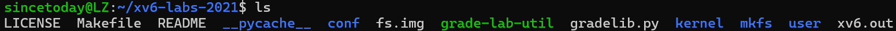
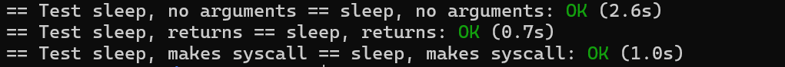
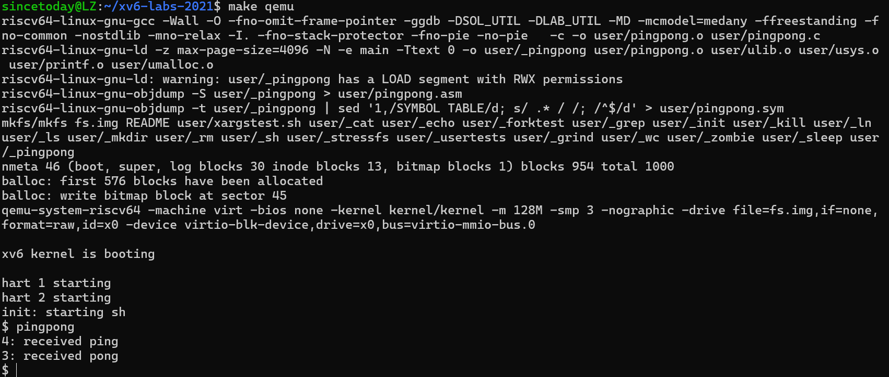
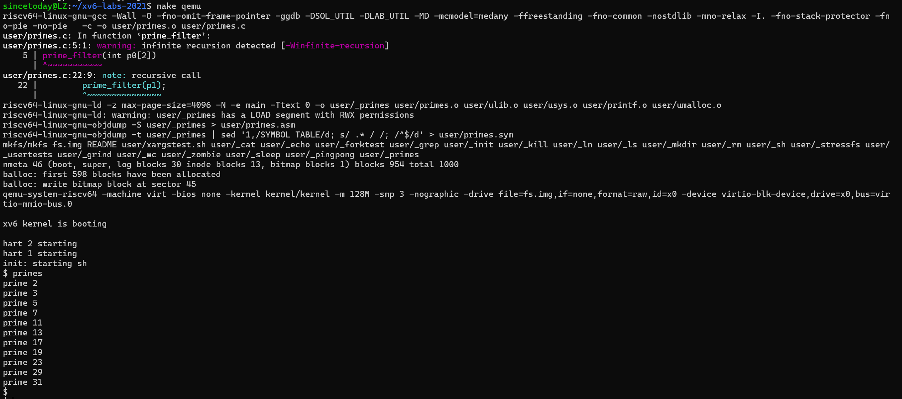
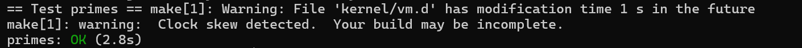
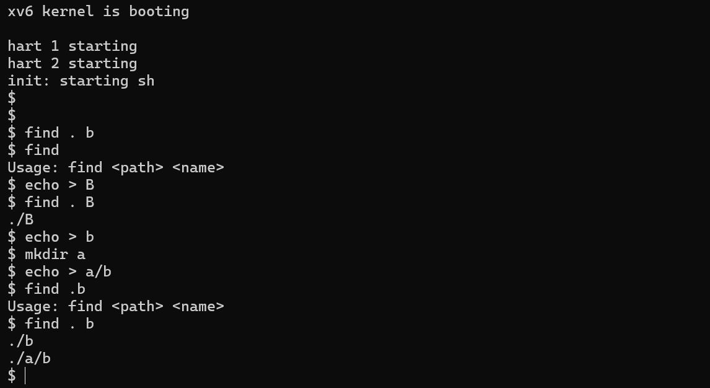
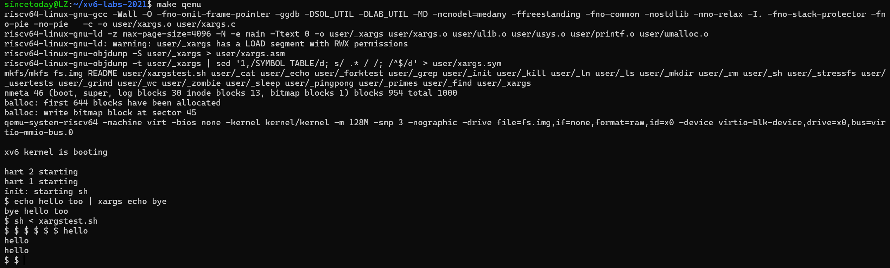

### Lab1 Utilities

#### Sublab1 Boot xv6

##### 一、环境搭建

在本地 Ubuntu 22.04 环境下配置 xv6 实验环境，按照课程指导文档，通过以下步骤成功搭建了开发与运行环境：首先安装了 Git、gcc、make、QEMU 和 RISC-V 工具链。其中，RISC-V 工具链我使用的是 `riscv64-unknown-elf-gcc`，确保编译器支持 xv6 所需的目标架构。之后克隆 xv6-labs-2021 的 Git 仓库，并切换到 `util` 分支。成功构建项目后，使用 `make qemu` 命令启动了 xv6 系统，验证系统可以顺利进入 shell。

##### 二、实验目的

本实验的主要目标是熟悉 xv6 操作系统的构建流程，掌握如何从源码构建一个最小可运行的 Unix-like 操作系统。同时，通过编译并运行 xv6，了解其基本启动过程，掌握 Git 的基本用法，为后续实验打下基础。

##### 三、实验内容

- 使用 `git clone git://g.csail.mit.edu/xv6-labs-2021` 克隆实验代码。
- 进入项目目录：`cd xv6-labs-2021`。
- 切换到 `util` 分支：`git checkout util`。
- 编译并启动系统：执行 `make qemu`。
- 查看 shell 是否成功启动，控制台输出应包含 `init: starting sh`。
- 在 xv6 shell 中运行 `ls` 命令，查看初始文件系统中的文件。



- 使用 Ctrl-a x 退出 QEMU 模拟器。

##### 四、实验中遇到的问题及解决方法

初次构建时遇到了 `riscv64-unknown-elf-gcc: command not found` 错误，后来发现是本地未安装 RISC-V 工具链。通过查阅课程提供的 lab tools 页面，使用 `sudo apt install gcc-riscv64-unknown-elf` 成功安装该工具链。

另一个问题是在运行 `make qemu` 时 QEMU 报错 "machine type 'virt' is not supported"，经排查是本地 QEMU 版本过旧，通过升级至最新版本后问题解决。

##### 五、实验心得

作为 xv6 的第一个实验，这次任务重点在于熟悉实验环境、工具链和系统启动流程。虽然步骤相对简单，但过程中对编译系统和工具链之间依赖关系的认识更加清晰。特别是 Git 分支的使用和 QEMU 的模拟原理，为理解后续更复杂的实验奠定了基础。下一阶段希望能更加深入理解 xv6 的系统调用和内核机制。


#### Sublab2 sleep

##### 一、环境搭建

延续上一个实验的环境，本次实验仍在 Ubuntu 22.04 本地环境下完成，使用的是 xv6-labs-2021 项目中的 `util` 分支。实验过程中继续使用 `make qemu` 启动系统，通过 xv6 shell 来验证程序行为。无需额外配置新的工具或依赖，确保代码加入 Makefile 后可以正确编译并运行。

##### 二、实验目的

本实验旨在实现 xv6 用户态下的 `sleep` 程序，使其能根据用户指定的 tick 数暂停执行。通过这个实验，熟悉 xv6 中系统调用的使用流程，包括如何从用户态调用内核功能，以及如何正确处理用户输入和程序退出。

##### 三、实验内容

- 在 `user/` 目录下新建文件 `sleep.c`。

- 在 `main` 函数中处理命令行参数，如果参数数量不足，打印错误信息并通过 `exit()` 退出程序。

- 使用 `atoi` 将传入的字符串转换为整数，得到 tick 数。

- 调用 `sleep` 系统调用，并在调用后通过 `exit()` 正常退出。

- 将 `sleep` 加入 Makefile 中的 `UPROGS` 列表，确保系统构建时包含该程序：

  ```
  UPROGS=\
      ... \
      _sleep\
  ```

- 使用 `make qemu` 编译并运行系统，在 shell 中输入 `sleep 100` 观察是否能暂停一段时间。


- 使用 `make grade` 或 `make GRADEFLAGS=sleep grade` 验证实验是否通过。



##### 四、实验结果分析

程序在 xv6 shell 中运行后，执行 `sleep 100`，终端会暂停一小段时间，无任何输出，随后正常返回 shell 提示符。实际等待时间与传入的 tick 数量一致，表明 `sleep` 系统调用成功生效，程序行为符合预期。通过 `make grade` 验证，也顺利通过了对应的 sleep 测试项。

##### 五、实验中遇到的问题及解决方法

刚开始忘记在 Makefile 的 `UPROGS` 中添加 `_sleep`，导致程序无法在 shell 中运行。将其补充进去后重新编译，问题解决。

另一个问题是参数未进行判断就直接使用了 `atoi`，在未传入参数时程序崩溃。加上参数数量检查后输出提示并使用 `exit()` 正常退出，程序表现符合预期。

##### 六、实验心得

这个实验虽然逻辑简单，但实际动手过程中让我明确了 xv6 用户程序与系统调用的交互路径。通过阅读 `user.h` 和 `usys.S`，理解了用户态如何通过封装调用内核中的接口函数。同时，写完后使用 `make grade` 检查结果的方式也让我熟悉了实验平台的测试体系，对后续调试和验证帮助很大。

##### 附：实验源码

```c
#include<kernel/types.h>
#include<user/user.h>

int 
main(int argc, char** argv){
    if(argc < 2){
        fprintf(2, "Usage: sleep <ticks>\n");
        exit(1);
    }
    int ticks = atoi(argv[1]);
    if(ticks < 0){
        fprintf(2, "sleep: ticks must be a postive number\n");
        exit(1);
    }
    sleep(ticks);
    exit(0);
}

```


#### Sublab3 pingpong

##### 一、环境搭建

本实验继续在 Ubuntu 22.04 本地环境下完成，使用 xv6-labs-2021 项目中的 `util` 分支。实验程序写入 `user/pingpong.c`，并在 Makefile 的 `UPROGS` 中加入 `_pingpong`，以确保程序被构建并可在 xv6 shell 中运行。使用 `make qemu` 启动系统进行验证。

##### 二、实验目的

本实验旨在通过管道和进程创建的组合使用，理解父子进程之间通过双向通信完成简单交互的流程。通过构建 ping-pong 模式，加深对 `fork`、`pipe`、`read`、`write` 和 `getpid` 系统调用的掌握。

##### 三、实验内容

- 在 `user/` 目录下新建 `pingpong.c` 文件。
- 使用 `pipe` 创建两个管道数组，分别用于父到子、子到父的通信。
- 调用 `fork` 创建子进程。
- 在子进程中：
  - 关闭不必要的 pipe 端。
  - 使用 `read` 接收来自父进程的字节。
  - 使用 `printf` 打印 ": received ping"。
  - 使用 `write` 将字节写回父进程。
  - 调用 `exit()` 正常退出。
- 在父进程中：
  - 关闭不必要的 pipe 端。
  - 向子进程写入一个字节。
  - 使用 `read` 接收子进程发回的字节。
  - 使用 `printf` 打印 ": received pong"。
  - 等待子进程退出，最后调用 `exit()`。
- 将 `_pingpong` 添加至 Makefile 中的 `UPROGS` 列表。
- 使用 `make qemu` 编译并运行程序，观察输出结果是否符合预期。

##### 四、实验结果分析

该程序在 xv6 shell 中运行时，首先由子进程输出其进程号和 "received ping"，接着父进程输出自身进程号和 "received pong"，符合题设预期。通过实验验证了管道在父子进程间实现数据双向流动的能力，也确认了系统调用在 xv6 用户态下的正确执行。




##### 五、实验中遇到的问题及解决方法

忽略了关闭不使用的 pipe 端口，导致进程在 `read` 时阻塞。补充关闭逻辑后，问题消失，通信流程顺利完成。

另一个小问题是输出内容中 `<pid>` 未正确替换，后来查阅 `getpid()` 的用法后修正，并使用 `%d` 打印得到的返回值。

##### 六、实验心得

这个实验是一个非常直观的进程通信练习。相比之前的 sleep 实验，本次对进程的控制和数据传递更加具体，尤其是通过两个管道模拟全双工通信的做法非常实用。实验过程中进一步加深了对系统调用使用场景的理解，也锻炼了调试 xv6 用户程序的能力。

##### 附：实验源码

```c
#include<kernel/types.h>
#include<user/user.h>

int
main(int argc, char** argv){
    int p2c[2]; // parent to child
    int c2p[2]; // child to parent
    char buf[1];

    /*
        pipe(fds[2]):
        可以创建一个管道, 往 fds[1] 写, 在 fds[0] 读
    */
    pipe(p2c);
    pipe(c2p);
    
    /*
        fork(void):
        复制当前进程，创建一个新的子进程:
        返回值为 0，代表子进程中返回;
        返回值 >0，代表从父进程中返回，返回值是子进程的 pid;
        返回值 <0，创建失败
    */
    int pid = fork();
    
    if(pid < 0){
        fprintf(2, "fork failed\n");
        exit(1);
    }
    if(pid == 0){
        read(p2c[0], buf, 1);
         printf("%d: received ping\n", getpid());
        write(c2p[1], buf, 1);
        exit(0);
    } 
    else {
        write(p2c[1], "x", 1);
        read(c2p[0], buf, 1);
        printf("%d: received pong\n", getpid());
        wait(0);
        exit(0);
    }
}
```


#### Sublab4 primes

##### 一、环境搭建

本实验继续在之前搭建好的 Ubuntu 22.04 + xv6-labs-2021 (`util` 分支) 环境中进行。实验代码位于 `user/primes.c`，程序需要在 xv6 用户态运行，并通过 `make qemu` 启动后在 shell 中测试功能。为了使程序能够被构建并在 xv6 中执行，需要将 `_primes` 添加至 Makefile 的 `UPROGS` 列表中。

##### 二、实验目的

通过实现并发版本的筛法 (sieve of Eratosthenes)，本实验旨在加深对进程间通信、管道 pipe 使用、以及多进程编程模型的理解。实验重点在于理解如何使用 `fork` 动态构建多个处理流程（每个进程负责过滤一个素数的倍数），并通过管道形成“流水线”式的计算结构。

##### 三、实验内容

- 在 `user/` 目录下创建 `primes.c` 文件。
- 主进程创建一个初始 pipe 和第一个子进程。
- 向初始管道写入整数 2 到 35（每次写入 4 字节 int）。
- 每个进程负责：
  - 从前一个 pipe 读取整数流；
  - 读取到第一个整数，将其作为本进程负责的“当前素数”；
  - 输出格式为 `prime <number>`；
  - 创建下一个 pipe 和子进程，传递未被当前素数整除的整数；
  - 如果读到 pipe 的 EOF（read 返回 0），则退出。
- 每个进程都要正确关闭无用的 pipe 端，防止资源泄漏。
- 主进程需等待所有子进程退出后再退出。

##### 四、实验结果分析

在 xv6 shell 中运行 `primes`，程序按顺序输出 2 到 35 范围内的所有素数。每个素数由不同进程通过筛选得到，输出格式为 `prime <number>`，且无重复、无遗漏，表明程序逻辑正确。同时，通过 `make grade` 对应测试项顺利通过，说明实验行为符合要求。





##### 五、实验中遇到的问题及解决方法

子进程未关闭未用的 pipe 写端，导致管道永不结束（`read` 阻塞），程序卡死。查阅文档后在每次 `fork` 后手动关闭不需要的 pipe 端，问题解决。

##### 六、实验心得

这是一个经典的并发通信模型实践实验，程序结构虽小，但蕴含大量进程管理、管道通信、资源释放控制等知识点。通过本实验，我更加深入地理解了 `fork` 与 `pipe` 的配合方式，也体会到了手动管理文件描述符的重要性。流水线式的结构非常有启发性，为后续理解更复杂的进程调度和通信机制提供了实践基础。

##### 附：实验源码

```c
#include "kernel/types.h"
#include "user/user.h"

void
prime_filter(int p0[2])
{
    close(p0[1]);
    int prime;
    if (read(p0[0], &prime, sizeof(int)) == 0) {
        close(p0[0]);
        exit(0);
    }
	// 输出管道中第一个数
    printf("prime %d\n", prime);

    int p1[2];
    pipe(p1);

    if (fork() == 0) {
        // 子进程：继续处理下一个素数
        close(p0[0]); // 不用读端
        prime_filter(p1);
    } else {
        // 父进程：读数，过滤当前 prime，再传给右侧子进程
        int num;
        while (read(p0[0], &num, sizeof(int))) {
            if (num % prime != 0) {
                write(p1[1], &num, sizeof(int));
            }
        }
        close(p0[0]);
        close(p1[1]); // 写完关闭写端，通知子进程 EOF
        wait(0);
        exit(0);
    }
}

int
main()
{
    int p[2];
    pipe(p);

    if (fork() == 0) {
        // 子进程：从管道读并进行筛选
        prime_filter(p);
    } else {
        // 父进程：生成 2~35，写入管道
        close(p[0]); // 不读
        for (int i = 2; i <= 35; i++) {
            write(p[1], &i, sizeof(int));
        }
        close(p[1]); // 写完关闭写端，通知子进程 EOF
        wait(0);
        exit(0);
    }
}

```


#### Sublab5 find

##### 一、环境搭建

本实验继续在之前搭建好的 xv6-labs-2021 (`util` 分支) 环境中进行。实验文件位于 `user/find.c`，并需要在 Makefile 的 `UPROGS` 中添加 `_find`，确保该程序在编译后可以在 xv6 shell 中运行。使用 `make qemu` 启动系统进行验证。为了测试方便，使用 shell 命令创建目录和文件结构。

##### 二、实验目的

本实验的目标是实现一个简化版的 `find` 程序，理解如何在 xv6 中遍历目录树、识别文件名，并结合字符串比较、递归函数等方法查找指定文件。通过本实验可以掌握目录结构的读取机制，并理解系统调用在遍历文件系统时的实际用法。

##### 三、实验内容

- 在 `user/` 目录下新建 `find.c` 文件。
- 编写递归函数：接收当前路径与目标文件名。
- 使用 `open` 和 `read` 读取当前路径下的目录项（结构见 `struct dirent`）。
- 跳过 "." 和 ".."，避免死循环。
- 判断当前项是否为目录：若是，则拼接路径并递归调用自身；否则比较文件名。
- 使用 `strcmp` 判断是否与目标名相符。
- 若匹配成功，则打印完整路径。
- 在 Makefile 的 `UPROGS` 列表中添加 `_find`。
- 使用 xv6 shell 进行如下测试：创建文件结构，调用 `find` 程序，检查输出是否匹配预期。

##### 四、实验结果分析

实验中执行如下命令：

```
$ echo > b
$ mkdir a
$ echo > a/b
$ find . b
```

输出结果为：

```
./b
./a/b
```

说明程序能正确遍历当前目录及子目录，并输出所有名称为 "b" 的文件路径。使用 `make grade` 对应测试项验证通过，程序功能符合实验要求。




##### 五、实验中遇到的问题及解决方法

最初使用 `==` 判断字符串是否匹配，导致比较始终失败。查阅资料后改为使用 `strcmp`，问题得到解决。

另一个问题是在路径拼接时未正确处理末尾斜杠，造成递归路径错误。通过在路径拼接前判断路径末尾并手动添加 `/`，确保拼接路径合法，递归逻辑才得以顺利运行。

##### 六、实验心得

通过这个实验对 xv6 的文件系统访问机制有了更深入的理解，特别是目录项的读取方式和路径处理逻辑。同时，也进一步熟悉了 C 语言中的字符串操作和递归函数实现。调试过程中遇到的路径和字符串比较问题也锻炼了细节处理能力。整体来看，这是一个典型的文件系统遍历实践，对后续理解 inode、目录树结构和路径解析机制都很有帮助。

##### 附：实验源码

```c
#include "kernel/types.h"
#include "kernel/stat.h"
#include "user/user.h"
#include "kernel/fs.h"
void
find(char *path, char *target)
{
    char buf[512], *p;
    int fd;
    struct dirent de;
    struct stat st;

    fd = open(path, 0);
    if (fd < 0) {
        fprintf(2, "find: cannot open %s\n", path);
        return;
    }

    if (fstat(fd, &st) < 0) {
        fprintf(2, "find: cannot stat %s\n", path);
        close(fd);
        return;
    }

    if (st.type != T_DIR) {
        char *last = path;
        for (char *s = path; *s; s++) {
            if (*s == '/')
                last = s + 1;
        }
        if (strcmp(last, target) == 0) {
            printf("%s\n", path);
        }
        close(fd);
        return;
    }

    if (strlen(path) + 1 + DIRSIZ + 1 > sizeof buf) {
        printf("find: path too long\n");
        close(fd);
        return;
    }

    strcpy(buf, path);
    p = buf + strlen(buf);
    *p++ = '/';

    while (read(fd, &de, sizeof(de)) == sizeof(de)) {
        if (de.inum == 0)
            continue;
        if (strcmp(de.name, ".") == 0 || strcmp(de.name, "..") == 0)
            continue;

        memmove(p, de.name, DIRSIZ);
        p[DIRSIZ] = 0;

        find(buf, target);
    }

    close(fd);
}

int
main(int argc, char *argv[])
{
    if (argc != 3) {
        fprintf(2, "Usage: find <path> <name>\n");
        exit(1);
    }
    find(argv[1], argv[2]);
    exit(0);
}
```


#### Sublab6 xargs

##### 一、环境搭建

本实验在既有的 xv6-labs-2021 实验环境中完成，仍使用 `util` 分支。实验代码位于 `user/xargs.c`，需将 `_xargs` 添加至 Makefile 的 `UPROGS` 项中以确保编译。系统通过 `make qemu` 启动，并可通过 shell 执行 `xargs` 程序进行测试。

##### 二、实验目的

本实验的目标是实现一个简化版的 `xargs` 工具，它可以从标准输入读取文本内容，将每行内容作为参数附加到固定命令之后并执行。通过本实验可以熟悉如何在 xv6 中处理输入、构建参数数组、使用 `fork` 创建子进程，并利用 `exec` 执行命令，同时在父进程中使用 `wait` 等待子进程完成。

##### 三、实验内容

- 在 `user/` 目录中创建 `xargs.c` 文件。

- 在主函数中：

  - 读取标准输入字符，直到遇到换行符构成一行。
  - 利用参数 `argv` 保存初始命令参数，如 `echo bye`。
  - 每读取一行输入，将其分词后添加到 `argv` 后构建完整参数列表。
  - 调用 `fork` 创建子进程，子进程中使用 `exec` 执行命令。
  - 父进程调用 `wait` 等待子进程执行完毕。

- 循环处理所有输入行。

- 程序结束前确保所有子进程均已处理完成。

- 在 xv6 shell 中执行如下命令进行验证：

  ```
  $ echo hello too | xargs echo bye
  bye hello too
  ```

* 最终使用 `sh < xargstest.sh` 测试脚本验证程序行为是否正确

  ```c
  $ sh < xargstest.sh
  $ $ $ $ $ $ hello
  hello
  hello
  $ $ 
  ```

##### 四、实验结果分析

程序在 shell 中运行效果如下所示：



使用 `sh < xargstest.sh` 可看到多行 `hello` 输出，符合预期。程序能正确读取标准输入，并将其转化为参数传递给命令，功能表现正常


##### 五、实验中遇到的问题及解决方法

开始阶段未正确处理 `argv` 拷贝，导致原命令参数在多次使用中被破坏。后改为在每次循环中重新构建新的 `argv` 数组，解决参数覆盖问题。

另一个问题是在读取字符并构建行缓冲时，未正确处理末尾换行导致程序死循环。添加显式字符串结束符后，确保每次传入 `exec` 的参数是合法字符串。

##### 六、实验心得

`xargs` 实验涵盖了输入读取、参数构建、进程控制、命令执行等多个操作系统核心机制。通过该实验，更熟练地掌握了 `fork-exec-wait` 的编程模式，同时理解了在 xv6 这样一个受限环境下处理字符串和输入流的细节问题。实验中对字符串数组管理的练习也提升了对底层内存操作的理解。

##### 附：实验源码

```c
#include "kernel/types.h"
#include "kernel/stat.h"
#include "user/user.h"
#include "kernel/param.h"

int
main(int argc, char *argv[])
{
    char buf[512];
    char *p;
    int i;

    char *xargv[MAXARG];
    for (i = 1; i < argc; i++) {
        xargv[i - 1] = argv[i];
    }
    int prefix_len = argc - 1;

    // 读取标准输入，一行一行处理
    p = buf;
    while (1) {
        char c;
        int n = read(0, &c, 1); // 从 stdin 读一个字符
        if (n <= 0) break;

        if (c == '\n') {
            *p = '\0';
            // 构造参数列表
            xargv[prefix_len] = buf;
            xargv[prefix_len + 1] = 0;

            if (fork() == 0) {
                exec(argv[1], xargv);
                fprintf(2, "exec failed\n");
                exit(1);
            } else {
                wait(0);
            }
            p = buf; // 重置指针准备读下一行
        } else {
            *p++ = c;
        }
    }

    exit(0);
}
```

