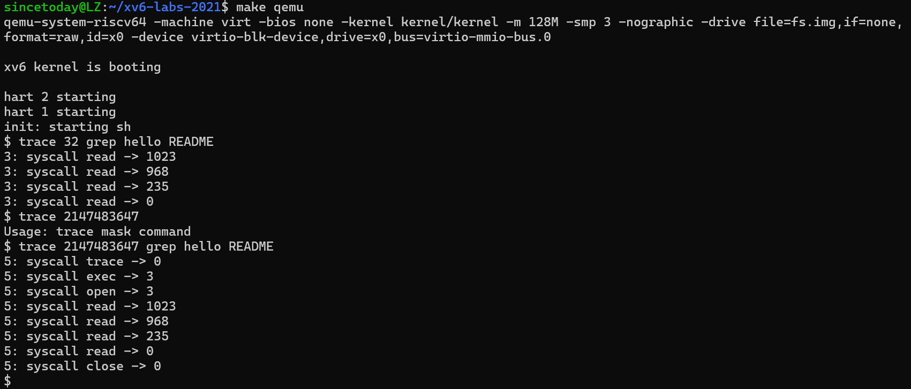

### Lab2 System calls

#### Sublab2 System Calls trace

##### 一、环境搭建

本实验在 xv6-labs-2021 的 `syscall` 分支中进行。首先执行 `git fetch` 和 `git checkout syscall` 切换分支，然后使用 `make clean` 清理旧的构建文件，确保以干净的状态开始实验。其余工具链与上一个实验一致，依然在 Ubuntu 22.04 上运行。实验中会涉及到对 xv6 内核源码的修改，包括用户态头文件、系统调用跳转表以及内核 syscall 处理逻辑等。

##### 二、实验目的

本实验旨在理解 xv6 中系统调用的完整路径和内部机制。通过实现新的系统调用 `trace`，掌握从用户空间添加接口，到内核注册、处理调用，再到用户程序中使用调用的完整流程。同时，通过该实验熟悉如何在内核中实现调试辅助工具，为后续实验提供追踪与诊断能力。

##### 三、实验内容

- 切换到 `syscall` 分支，准备新的实验代码环境：

  ```
  $ git fetch
  $ git checkout syscall
  $ make clean
  ```

- 添加 `trace` 系统调用的用户接口：

  - 在 `user/user.h` 中添加函数声明：`int trace(int);`
  - 在 `user/usys.pl` 中添加一行：`entry("trace");`
  - 在 `kernel/syscall.h` 中定义 syscall 编号：`#define SYS_trace ...`

- 实现 `trace` 的内核逻辑：

  - 在 `kernel/proc.h` 的 `struct proc` 中添加一个 `int tracemask` 字段，用于记录当前进程的追踪掩码。
  - 在 `kernel/sysproc.c` 中添加 `uint64 sys_trace(void)` 实现，提取传入参数并存入进程结构体。

- 修改 `fork()`：

  - 在 `kernel/proc.c` 中，确保子进程复制父进程的 `tracemask` 值。

- 修改 `syscall()` 函数：

  - 在 `kernel/syscall.c` 中添加系统调用名称数组 `char *syscall_names[] = {"fork", "exit", ...}`
  - 在每次 syscall 执行后判断当前进程的 `tracemask`，若命中当前调用号，则输出格式：`<pid>: syscall <name> -> <ret>`。

- 编译测试程序 trace：在 Makefile 的 `UPROGS` 中添加 `_trace`，执行 `make qemu` 后可运行 trace 相关命令进行测试。

##### 四、实验结果分析

运行 `trace 32 grep hello README`，输出显示 `read` 系统调用的执行及返回值，表明追踪机制生效。使用 `trace 2147483647` 可追踪全部系统调用，也能在复杂场景下验证多进程追踪的正确性。运行 `sh < xargstest.sh` 等测试脚本后，可见系统调用记录信息按预期输出。执行 `make grade` 通过所有与 `trace` 和 `sysinfotest` 相关的测试项，说明系统调用功能已正确实现




##### 五、实验中遇到的问题及解决方法

在 `syscall()` 中打印信息时报了空指针错误，发现是未为所有系统调用定义名称。补充 `syscall_names` 数组并与编号对齐后解决。

##### 六、实验心得

本实验涉及了 xv6 用户态与内核态之间交互机制的多个关键点。通过手动添加系统调用，加深了对 syscall 编号、参数传递、进程状态维护等方面的理解。尤其是修改 `syscall()` 实现追踪逻辑的过程，使我更加清楚了内核调用调度流程。这个实验不仅具有较高的工程实践性，也为后续调试更复杂的内核逻辑提供了有效的工具支持。

##### 附：实验部分源码

修改 `kernel/sysproc.c`：添加 `sys_trace`

```c
extern struct proc* myproc(void);

uint64
sys_trace(void)
{
  int mask;
  if (argint(0, &mask) < 0)
    return -1;

  myproc()->trace_mask = mask;
  return 0;
}
```

添加系统调用名称数组

```c
static char *syscall_names[] = {
  [SYS_fork]   "fork",
  [SYS_exit]   "exit",
  [SYS_wait]   "wait",
  [SYS_pipe]   "pipe",
  [SYS_read]   "read",
  [SYS_kill]   "kill",
  [SYS_exec]   "exec",
  [SYS_fstat]  "fstat",
  [SYS_chdir]  "chdir",
  [SYS_dup]    "dup",
  [SYS_getpid] "getpid",
  [SYS_sbrk]   "sbrk",
  [SYS_sleep]  "sleep",
  [SYS_uptime] "uptime",
  [SYS_open]   "open",
  [SYS_write]  "write",
  [SYS_mknod]  "mknod",
  [SYS_unlink] "unlink",
  [SYS_link]   "link",
  [SYS_mkdir]  "mkdir",
  [SYS_close]  "close",
  [SYS_trace]  "trace"
};
```

找到 `fork()` 函数，在创建新进程的逻辑中加上：

```c
np->trace_mask = p->trace_mask;
```


#### Subab2 Sysinfo

##### 一、环境搭建

本实验在 `syscall` 分支下继续进行，与上一个实验共用同一构建环境。通过 `make clean` 保证环境干净，再使用 `make qemu` 启动 xv6 系统。实验文件主要包括 `kernel/sysproc.c`、`kernel/kalloc.c`、`kernel/proc.c`，以及新增的头文件 `kernel/sysinfo.h`。测试程序为 `user/sysinfotest.c`，确保 `_sysinfotest` 已添加至 Makefile 的 `UPROGS` 列表中。

##### 二、实验目的

实现一个名为 `sysinfo` 的系统调用，用于从内核中获取当前系统运行状态，包括空闲内存大小和活跃进程数。通过本实验，进一步理解用户态与内核态之间的数据传输方法，尤其是使用 `copyout` 将结构体传递回用户空间的技术。

##### 三、实验内容

- 在 `kernel/sysinfo.h` 中定义 `struct sysinfo`：包括 `uint64 freemem` 和 `uint64 nproc`。
- 在 `user/user.h` 中声明 `struct sysinfo; int sysinfo(struct sysinfo *);`
- 在 `user/usys.pl` 中添加 `entry("sysinfo");`
- 在 `kernel/syscall.h` 中为 `SYS_sysinfo` 添加编号
- 在 `kernel/sysproc.c` 中实现 `sys_sysinfo()`，步骤如下：
  - 调用新增函数 `freemem()` 获取当前空闲内存（从 `kalloc.c` 中实现）
  - 调用 `procinfo()` 获取活跃进程数（从 `proc.c` 中实现）
  - 使用 `copyout()` 将 `struct sysinfo` 写回用户空间
- 在 `kernel/syscall.c` 中注册 `sys_sysinfo()`
- 执行 `make qemu`，运行 `sysinfotest` 检查功能是否正确实现

##### 四、实验结果分析

运行 `make qemu` 后执行 `sh < xargstest.sh` 和 `sysinfotest`，控制台输出包括：

```
sysinfotest: OK
```

表明系统调用功能已被正确识别和执行，内核能够准确将系统状态通过结构体返回给用户程序。`make grade` 同样成功通过与 sysinfo 相关的测试项


##### 五、实验中遇到的问题及解决方法

实现 `copyout()` 时传入的用户指针地址有误，导致无法写入结构体数据。后对照 `sys_fstat()` 修改为使用 `argaddr()` 获取用户指针地址后传入 `copyout()`，问题解决。

##### 六、实验心得

这个实验涉及内核向用户空间传递结构体的关键机制，是非常典型的系统调用数据通信练习。结合上一个实验，对 syscall 机制的理解更加全面，尤其是 `copyin/copyout`、参数解析与内核信息封装等部分的掌握更为扎实。

##### 附：实验部分源码

`kernel/kalloc.c` 中添加：

```c
freemem(void)
{
  struct run *r;
  uint64 free = 0;

  acquire(&kmem.lock);
  for (r = kmem.freelist; r; r = r->next)
    free += PGSIZE;
  release(&kmem.lock);

  return free;
}
```

 `kernel/proc.c` 中添加：

```c
count_proc(void)
{
  struct proc *p;
  int count = 0;

  for (p = proc; p < &proc[NPROC]; p++) {
    if (p->state != UNUSED)
      count++;
  }

  return count;
}
```

修改 `kernel/sysproc.c`

```c
#include "sysinfo.h"
extern uint64 freemem();
extern int count_proc();

uint64
sys_sysinfo(void)
{
  struct sysinfo info;
  uint64 uaddr;

  if (argaddr(0, &uaddr) < 0)
    return -1;

  info.freemem = freemem();
  info.nproc = count_proc();

  if (copyout(myproc()->pagetable, uaddr, (char *)&info, sizeof(info)) < 0)
    return -1;

  return 0;
}
```

