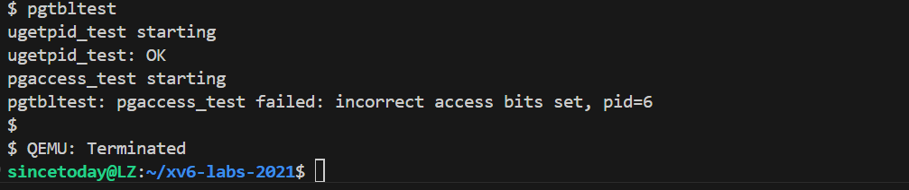
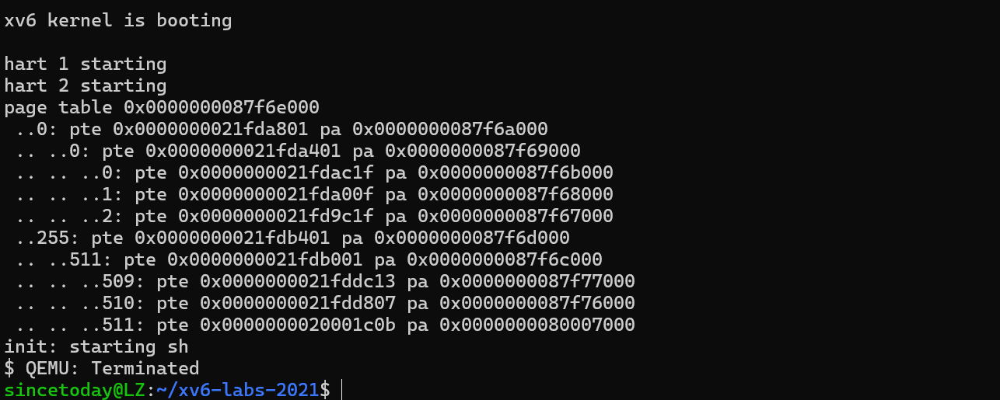
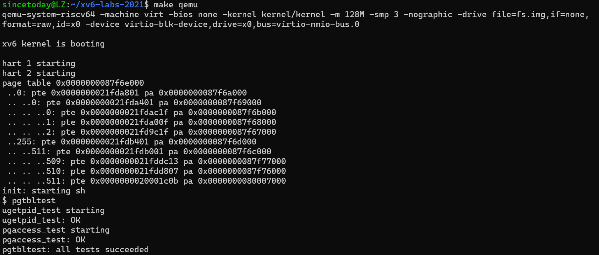
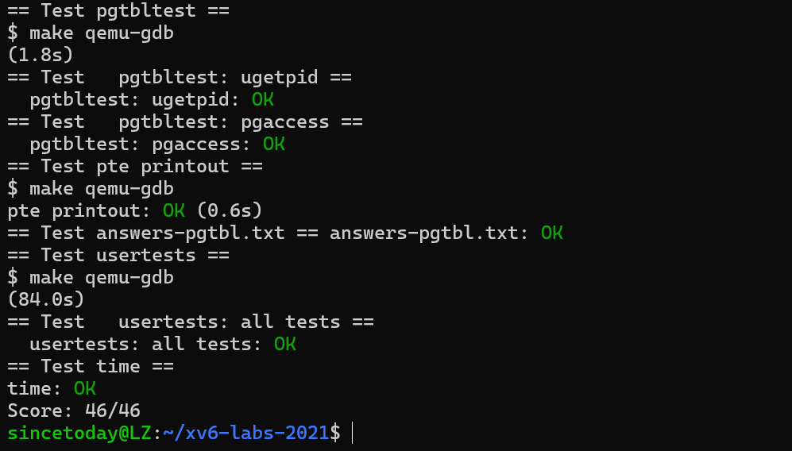

### Lab3 Page tables

#### Sublab1 Speed up system calls

##### 一、环境搭建

本实验在 xv6-labs-2021 的 `pgtbl` 分支中进行。首先执行 `git fetch` 和 `git checkout pgtbl` 切换分支，然后运行 `make clean` 清理旧的构建文件，确保以干净的状态开始实验。实验在 Ubuntu 22.04 上完成，使用 QEMU 进行 xv6 虚拟机模拟，gcc 工具链编译 xv6 源码。本次实验需要修改 xv6 内核中的虚拟内存相关代码，涉及文件包括 `kernel/proc.c`、`kernel/vm.c`、`kernel/kalloc.c` 以及 `kernel/memlayout.h`。

##### 二、实验目的

本实验旨在通过优化 `getpid()` 系统调用的实现，掌握在 xv6 中手动建立用户空间页表映射的方法。通过在用户空间映射一个只读页并写入当前进程信息，减少内核态与用户态的切换，从而加快系统调用执行效率。同时通过该实验理解用户页表的构建和权限控制机制。

##### 三、实验内容

- 在 `memlayout.h` 中已定义 `USYSCALL` 地址和 `struct usyscall` 结构体。
- 在 `allocproc()` 中：
  - 调用 `kalloc()` 分配一页物理内存作为 `usys`。
  - 将当前进程的 PID 写入该页起始位置。
- 在 `proc_pagetable()` 中：
  - 使用 `mappages()` 将该页映射到用户页表中的 `USYSCALL` 虚拟地址。
  - 设置 PTE 只读且用户可读权限（`PTE_U | PTE_R`）。
- 在 `freeproc()` 中：
  - 调用 `kfree()` 释放在 `allocproc()` 中分配的页。
- 编译运行 `make qemu`, 执行 `pgtbltest` 中的 `ugetpid` 测试，验证功能。

##### 四、实验结果分析

运行 `make qemu` 并执行 `pgtbltest`，输出中显示通过 `USYSCALL` 地址获取的 PID 与实际进程 PID 一致，说明只读页表映射和 PID 写入逻辑均正确。对比传统的 `getpid()` 系统调用方式，`ugetpid()` 不再产生陷入内核的开销，验证了此优化的有效性。



##### 五、实验中遇到的问题及解决方法

在 `proc_pagetable()` 中调用 `mappages()` 时未正确设置页表项权限，导致访问 `USYSCALL` 地址时报非法访问错误。查阅 RISC-V 页表权限位定义后，将权限设置为 `PTE_U | PTE_R` 后问题解决。

##### 六、实验心得

通过本实验深入理解了 xv6 中用户空间页表的构建过程，掌握了如何在用户空间映射只读数据页以及如何通过页表权限控制用户访问。实验虽然修改量小，但对理解虚拟内存管理和系统调用优化机制具有重要意义，也为后续实现更复杂的页表操作打下了基础。

##### 附：实验部分源码

在 `allocproc` 函数中添加：

```c
  // 分配 usyscall 映射页
  p->usyscall = (struct usyscall *)kalloc();
  if(p->usyscall == 0){
    freeproc(p);
    return 0;
  }
  memset(p->usyscall, 0, PGSIZE);
  p->usyscall->pid = p->pid;  // 设置 pid
```

在 `proc_pagetable` 函数中添加：

```c
  // 用户态共享页映射
  if (mappages(pagetable, USYSCALL, PGSIZE, (uint64)p->usyscall, PTE_R | PTE_U) < 0) {
    uvmunmap(pagetable, USYSCALL, 1, 0);
    freewalk(pagetable); 
    return 0;
  }
```

在 `freeproc` 函数中添加：

```c
  if(p->pagetable){
    uvmunmap(p->pagetable, USYSCALL, 1, 0); 
    uvmfree(p->pagetable, p->sz);
    p->pagetable = 0;
  }

  if(p->usyscall){
    kfree((void*)p->usyscall);
    p->usyscall = 0;
  }
```


#### Sublab2 Print a page table (easy)

##### 一、环境搭建

本实验在 xv6-labs-2021 的 `lazy` 分支中进行。首先通过 `git fetch` 拉取最新远程分支，再使用 `git checkout lazy` 切换至实验分支，并执行 `make clean` 清除上一次构建结果，确保本次实验从干净状态开始。其余开发环境沿用前一实验，基于 Ubuntu 22.04，使用 QEMU 启动并调试 xv6 系统，进行内核级别的开发与测试。

##### 二、实验目的

本实验旨在深入理解 RISC-V 多级页表结构及其在 xv6 中的实现方式。通过实现 `vmprint()` 函数，遍历并打印页表内容，可以帮助理解虚拟地址到物理地址的映射过程，掌握页表层级结构，以及调试和可视化页表的技巧。

##### 三、实验内容

- 在 `kernel/defs.h` 中添加函数声明：

  ```c
  void vmprint(pagetable_t);
  ```

- 在 `kernel/vm.c` 中实现 `vmprint()` 函数：

  - 使用递归遍历页表结构，打印每一层页表中的有效项。
  - 每层通过 `PTE2PA(pte)` 递归调用下一层页表。
  - 使用 `printf(".. ..")` 控制缩进，表示页表深度。
  - 忽略无效项（未设置 PTE_V 位）。

- 在 `kernel/exec.c` 中 `exec()` 函数末尾添加打印项

- 编译并运行 xv6，观察 init 进程启动后的页表打印信息。

##### 四、实验结果分析

启动 xv6 后，在 init 程序执行完成 exec() 时，控制台输出如下页表信息：



可以看到页表结构完整，输出格式与实验说明一致。每层页表的索引、PTE 值及物理地址均按预期输出，说明递归遍历和格式化逻辑正确。

##### 五、实验中遇到的问题及解决方法

无

##### 六、实验心得

通过本实验对 RISC-V 的三级页表结构有了更清晰的理解。实现 `vmprint()` 的过程中，加深了对页表项结构及其权限位含义的认识。递归遍历页表也锻炼了处理多级数据结构的能力。该功能对调试虚拟内存问题具有重要意义，为后续实验中深入处理页表和内存映射奠定了基础。

##### 附：实验部分源码

```c
static void
vmprint_rec(pagetable_t pagetable, int depth)
{
  for(int i = 0; i < 512; i++){
    pte_t pte = pagetable[i];
    if(pte & PTE_V){                 // 只打印有效 PTE
      uint64 pa = PTE2PA(pte);
      for(int d = 0; d < depth; d++)
        printf(" ..");
      printf("%d: pte %p pa %p\n", i, pte, pa);

      // 如果该 PTE 指向下一层页表，需要继续递归。
      if((pte & (PTE_R|PTE_W|PTE_X)) == 0){
        pagetable_t child = (pagetable_t)pa;
        vmprint_rec(child, depth + 1);
      }
    }
  }
}
```


#### Sublab3 Detecting which pages have been accessed

##### 一、环境搭建

本实验继续在 xv6-labs-2021 的 `pgtbl` 分支上进行，实验环境沿用前面实验，包括 Ubuntu 22.04、QEMU、GCC 工具链等。在开始实验前执行 `make clean` 清除旧文件，保证构建干净，并通过 `make qemu` 启动 xv6 系统进行调试。调试过程中主要依赖 `pgtbltest` 测试用例及 `make grade` 工具进行验证。

##### 二、实验目的

本实验的目标是实现一个新的系统调用 `pgaccess`，用于检测用户虚拟地址空间中指定页是否被访问过。通过查询 RISC-V 页表项中的访问标志位（PTE_A），用户态程序可以获取页面是否被读取或写入的状态信息，这对于实现某些类型的垃圾回收器具有重要意义。通过该实验，进一步理解 PTE 位标志的作用及页表与硬件交互的细节。

##### 三、实验内容

- 在 `kernel/riscv.h` 中定义访问标志位宏：

  ```c
  #define PTE_A (1L << 6)
  ```

- 在 `kernel/sysproc.c` 中添加 `sys_pgaccess()` 实现：

  - 使用 `argaddr()` 获取起始虚拟地址和用户态位图存储地址。
  - 使用 `argint()` 获取页数。
  - 设置最大检测页数限制（例如 64）。
  - 申请一个 `uint64` 的临时变量作为位图缓冲区。
  - 遍历每页，使用 `walk()` 获取页表项，检查是否设置 PTE_A。
  - 若访问位存在，则在结果中对应位置置位，同时清除该访问位。
  - 使用 `copyout()` 将结果位图复制回用户空间。

- 在 `kernel/syscall.c` 和 `kernel/syscall.h` 中添加 syscall 定义：

  ```c
  [SYS_pgaccess]    sys_pgaccess,
  #define SYS_pgaccess 22
  ```

- 在 `user/user.h` 和 `user/usys.pl` 中添加用户态接口：

  ```c
  int pgaccess(const void *addr, int len, void *mask);
  entry("pgaccess");
  ```

##### 四、实验结果分析

运行 `make qemu` 后执行 `pgtbltest` 测试程序，可以看到 `pgaccess` 功能被调用并返回正确的页面访问信息。位图结果能正确反映哪些页被访问过，并在再次调用后清除标志位避免重复识别。最终执行 `make grade`，其中 `pgaccess` 测试项通过，说明系统调用功能实现正确。





##### 五、实验中遇到的问题及解决方法

测试时系统调用一直返回错误码，后排查发现 `argaddr()` 参数顺序错误，导致获取地址失败；修正参数顺序后正常。另一个问题是在清除 PTE_A 位时，未正确使用 `*pte &= ~PTE_A` 表达式，导致位图结果始终不变。经检查并修复后，系统调用行为符合预期。

##### 六、实验心得

本实验加深了我对页表项位结构的理解，尤其是硬件标志位（如 PTE_A）的作用及其动态变化机制。实现过程中涉及系统调用参数传递、内核与用户空间数据交互、页表遍历与修改等多个知识点，锻炼了内核开发综合能力。同时，借助 `pgaccess` 这样的小功能，可以帮助用户态程序有效感知页面使用情况，为后续实现更复杂的内存管理机制提供了基础。

##### 附：实验部分源码

 编辑 `kernel/sysproc.c`，添加 `sys_pgaccess()`：

```c
#define MAX_PGACCESS 64

uint64
sys_pgaccess(void)
{
  uint64 va_start, user_mask_ptr;
  int npages;

  if (argaddr(0, &va_start) < 0 ||
      argint(1, &npages) < 0 ||
      argaddr(2, &user_mask_ptr) < 0)
    return -1;

  if (npages <= 0 || npages > MAX_PGACCESS)
    return -1;

  struct proc *p = myproc();
  uint64 mask = 0;

  for (int i = 0; i < npages; i++) {
    uint64 va = va_start + i * PGSIZE;
    pte_t *pte = walk(p->pagetable, va, 0);
    if (pte && (*pte & PTE_A)) {
      mask |= (1UL << i);     // 设置对应位
      *pte &= ~PTE_A;         // 清除 A 位
    }
  }

  if (copyout(p->pagetable, user_mask_ptr, (char *)&mask, sizeof(mask)) < 0)
    return -1;

  return 0;
}
```

