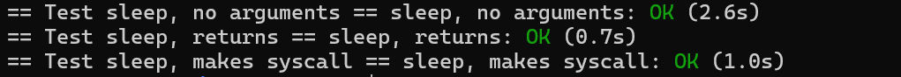
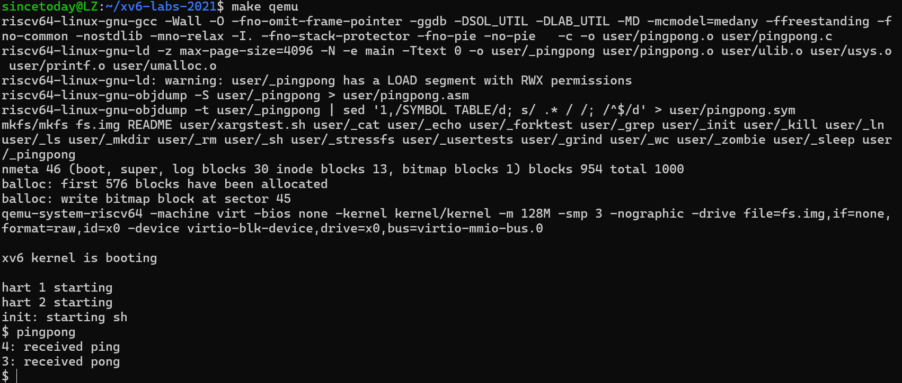
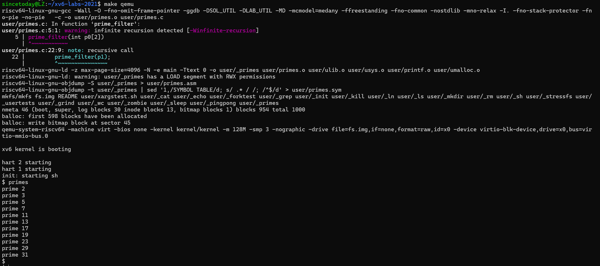
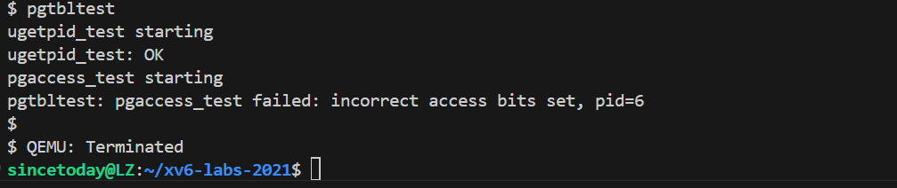
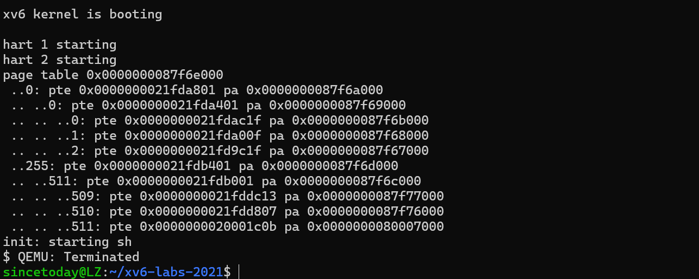
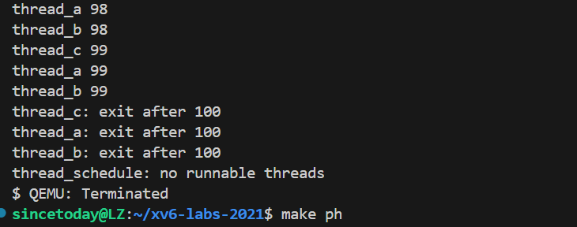
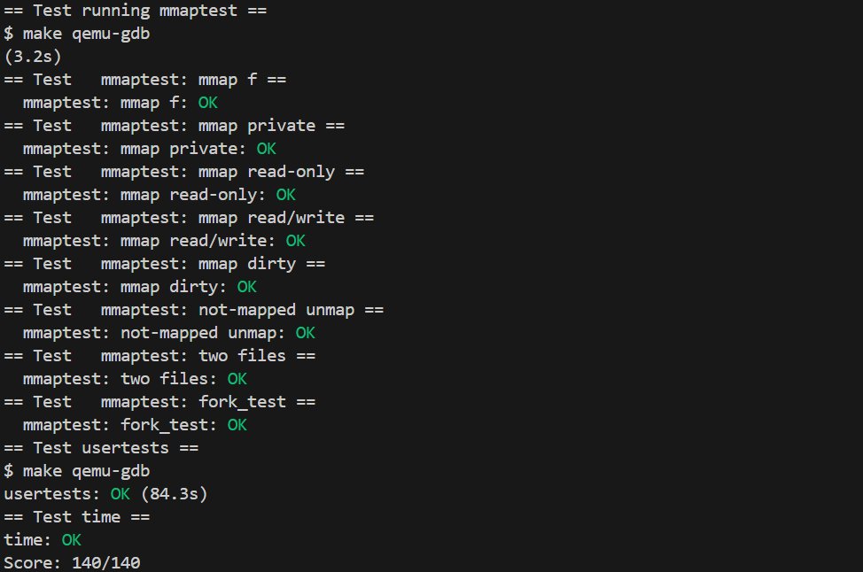

## 操作系统课程设计实验报告

**基于 xv6 系统的 MIT 课程实验**       **2352471 刘震**

**实验代码在另外10个分支**


* [Lab Utilities](#lab1-utilities)
  * [Boot xv6](#sublab1-boot-xv6)
  * [sleep](#sublab2-sleep)
  * [pingpong](#sublab3-pingpong)
  * [primes](#sublab4-primes)
  * [find](#sublab5-find)
* [Lab System calls](#lab2-system-calls)
  * [System call tracing](#sublab1-system-call-tracing)
  * [Sysinfo](#sublab2-sysinfo)
* [Lab Page tables](#lab3-page-tables)
  * [Speed up system calls](#sublab1-speed-up-system-calls)
  * [Print a page table](#sublab2-print-a-page-table)
  * [Detecting which pages have been accessed](#sublab3-detecting-which-pages-have-been-accessed)
* [Lab Traps](#lab4-traps)
  * [RISC-V assembly](#sublab1-risc-v-assembly)
  * [Backtrace](#sublab2-backtrace)
  * [Alarm](#sublab3-alarm)
* [Lab Copy on-write](#lab5-copy-on-write)
  * [Implement copy-on write](#sublab-implement-copy-on-write)
* [Lab Multithreading](#lab6-multithreading)
  * [Uthread: switching between threads](#sublab1-uthread-switching-between-threads)
  * [Using threads](#sublab2-using-threads)
  * [Barrier](#sublab3-barrier)
* [Lab network driver](#lab7-network-driver)
  * [Your Job](#sublab-your-job)
* [Lab Lock](#lab8-lock)
  * [Memory allocator](#sublab1-memory-allocator)
  * [Buffer cache](#sublab2-buffer-cache)
* [Lab File system](#lab9-file-system)
  * [Large files](#sublab1-large-files)
  * [Symbolic links](#sublab2-symbolic-links)
* [Lab mmap](#lab10-mmap)


### Lab1 Utilities

#### Sublab1 Boot xv6

##### 一、环境搭建

在本地 Ubuntu 22.04 环境下配置 xv6 实验环境，按照课程指导文档，通过以下步骤成功搭建了开发与运行环境：首先安装了 Git、gcc、make、QEMU 和 RISC-V 工具链。其中，RISC-V 工具链我使用的是 `riscv64-unknown-elf-gcc`，确保编译器支持 xv6 所需的目标架构。之后克隆 xv6-labs-2021 的 Git 仓库，并切换到 `util` 分支。成功构建项目后，使用 `make qemu` 命令启动了 xv6 系统，验证系统可以顺利进入 shell。

##### 二、实验目的

本实验的主要目标是熟悉 xv6 操作系统的构建流程，掌握如何从源码构建一个最小可运行的 Unix-like 操作系统。同时，通过编译并运行 xv6，了解其基本启动过程，掌握 Git 的基本用法，为后续实验打下基础。

##### 三、实验内容

- 使用 `git clone git://g.csail.mit.edu/xv6-labs-2021` 克隆实验代码。
- 进入项目目录：`cd xv6-labs-2021`。
- 切换到 `util` 分支：`git checkout util`。
- 编译并启动系统：执行 `make qemu`。
- 查看 shell 是否成功启动，控制台输出应包含 `init: starting sh`。
- 在 xv6 shell 中运行 `ls` 命令，查看初始文件系统中的文件。


- 使用 Ctrl-a x 退出 QEMU 模拟器。

##### 四、实验中遇到的问题及解决方法

初次构建时遇到了 `riscv64-unknown-elf-gcc: command not found` 错误，后来发现是本地未安装 RISC-V 工具链。通过查阅课程提供的 lab tools 页面，使用 `sudo apt install gcc-riscv64-unknown-elf` 成功安装该工具链。

另一个问题是在运行 `make qemu` 时 QEMU 报错 "machine type 'virt' is not supported"，经排查是本地 QEMU 版本过旧，通过升级至最新版本后问题解决。

##### 五、实验心得

作为 xv6 的第一个实验，这次任务重点在于熟悉实验环境、工具链和系统启动流程。虽然步骤相对简单，但过程中对编译系统和工具链之间依赖关系的认识更加清晰。特别是 Git 分支的使用和 QEMU 的模拟原理，为理解后续更复杂的实验奠定了基础。下一阶段希望能更加深入理解 xv6 的系统调用和内核机制。


#### Sublab2 sleep

##### 一、环境搭建

延续上一个实验的环境，本次实验仍在 Ubuntu 22.04 本地环境下完成，使用的是 xv6-labs-2021 项目中的 `util` 分支。实验过程中继续使用 `make qemu` 启动系统，通过 xv6 shell 来验证程序行为。无需额外配置新的工具或依赖，确保代码加入 Makefile 后可以正确编译并运行。

##### 二、实验目的

本实验旨在实现 xv6 用户态下的 `sleep` 程序，使其能根据用户指定的 tick 数暂停执行。通过这个实验，熟悉 xv6 中系统调用的使用流程，包括如何从用户态调用内核功能，以及如何正确处理用户输入和程序退出。

##### 三、实验内容

- 在 `user/` 目录下新建文件 `sleep.c`。

- 在 `main` 函数中处理命令行参数，如果参数数量不足，打印错误信息并通过 `exit()` 退出程序。

- 使用 `atoi` 将传入的字符串转换为整数，得到 tick 数。

- 调用 `sleep` 系统调用，并在调用后通过 `exit()` 正常退出。

- 将 `sleep` 加入 Makefile 中的 `UPROGS` 列表，确保系统构建时包含该程序：

  ```
  UPROGS=\
      ... \
      _sleep\
  ```

- 使用 `make qemu` 编译并运行系统，在 shell 中输入 `sleep 100` 观察是否能暂停一段时间。


- 使用 `make grade` 或 `make GRADEFLAGS=sleep grade` 验证实验是否通过。



##### 四、实验结果分析

程序在 xv6 shell 中运行后，执行 `sleep 100`，终端会暂停一小段时间，无任何输出，随后正常返回 shell 提示符。实际等待时间与传入的 tick 数量一致，表明 `sleep` 系统调用成功生效，程序行为符合预期。通过 `make grade` 验证，也顺利通过了对应的 sleep 测试项。

##### 五、实验中遇到的问题及解决方法

刚开始忘记在 Makefile 的 `UPROGS` 中添加 `_sleep`，导致程序无法在 shell 中运行。将其补充进去后重新编译，问题解决。

另一个问题是参数未进行判断就直接使用了 `atoi`，在未传入参数时程序崩溃。加上参数数量检查后输出提示并使用 `exit()` 正常退出，程序表现符合预期。

##### 六、实验心得

这个实验虽然逻辑简单，但实际动手过程中让我明确了 xv6 用户程序与系统调用的交互路径。通过阅读 `user.h` 和 `usys.S`，理解了用户态如何通过封装调用内核中的接口函数。同时，写完后使用 `make grade` 检查结果的方式也让我熟悉了实验平台的测试体系，对后续调试和验证帮助很大。

##### 附：实验源码

```c
#include<kernel/types.h>
#include<user/user.h>

int 
main(int argc, char** argv){
    if(argc < 2){
        fprintf(2, "Usage: sleep <ticks>\n");
        exit(1);
    }
    int ticks = atoi(argv[1]);
    if(ticks < 0){
        fprintf(2, "sleep: ticks must be a postive number\n");
        exit(1);
    }
    sleep(ticks);
    exit(0);
}

```


#### Sublab3 pingpong

##### 一、环境搭建

本实验继续在 Ubuntu 22.04 本地环境下完成，使用 xv6-labs-2021 项目中的 `util` 分支。实验程序写入 `user/pingpong.c`，并在 Makefile 的 `UPROGS` 中加入 `_pingpong`，以确保程序被构建并可在 xv6 shell 中运行。使用 `make qemu` 启动系统进行验证。

##### 二、实验目的

本实验旨在通过管道和进程创建的组合使用，理解父子进程之间通过双向通信完成简单交互的流程。通过构建 ping-pong 模式，加深对 `fork`、`pipe`、`read`、`write` 和 `getpid` 系统调用的掌握。

##### 三、实验内容

- 在 `user/` 目录下新建 `pingpong.c` 文件。
- 使用 `pipe` 创建两个管道数组，分别用于父到子、子到父的通信。
- 调用 `fork` 创建子进程。
- 在子进程中：
  - 关闭不必要的 pipe 端。
  - 使用 `read` 接收来自父进程的字节。
  - 使用 `printf` 打印 ": received ping"。
  - 使用 `write` 将字节写回父进程。
  - 调用 `exit()` 正常退出。
- 在父进程中：
  - 关闭不必要的 pipe 端。
  - 向子进程写入一个字节。
  - 使用 `read` 接收子进程发回的字节。
  - 使用 `printf` 打印 ": received pong"。
  - 等待子进程退出，最后调用 `exit()`。
- 将 `_pingpong` 添加至 Makefile 中的 `UPROGS` 列表。
- 使用 `make qemu` 编译并运行程序，观察输出结果是否符合预期。

##### 四、实验结果分析

该程序在 xv6 shell 中运行时，首先由子进程输出其进程号和 "received ping"，接着父进程输出自身进程号和 "received pong"，符合题设预期。通过实验验证了管道在父子进程间实现数据双向流动的能力，也确认了系统调用在 xv6 用户态下的正确执行。




##### 五、实验中遇到的问题及解决方法

忽略了关闭不使用的 pipe 端口，导致进程在 `read` 时阻塞。补充关闭逻辑后，问题消失，通信流程顺利完成。

另一个小问题是输出内容中 `<pid>` 未正确替换，后来查阅 `getpid()` 的用法后修正，并使用 `%d` 打印得到的返回值。

##### 六、实验心得

这个实验是一个非常直观的进程通信练习。相比之前的 sleep 实验，本次对进程的控制和数据传递更加具体，尤其是通过两个管道模拟全双工通信的做法非常实用。实验过程中进一步加深了对系统调用使用场景的理解，也锻炼了调试 xv6 用户程序的能力。

##### 附：实验源码

```c
#include<kernel/types.h>
#include<user/user.h>

int
main(int argc, char** argv){
    int p2c[2]; // parent to child
    int c2p[2]; // child to parent
    char buf[1];

    /*
        pipe(fds[2]):
        可以创建一个管道, 往 fds[1] 写, 在 fds[0] 读
    */
    pipe(p2c);
    pipe(c2p);
    
    /*
        fork(void):
        复制当前进程，创建一个新的子进程:
        返回值为 0，代表子进程中返回;
        返回值 >0，代表从父进程中返回，返回值是子进程的 pid;
        返回值 <0，创建失败
    */
    int pid = fork();
    
    if(pid < 0){
        fprintf(2, "fork failed\n");
        exit(1);
    }
    if(pid == 0){
        read(p2c[0], buf, 1);
         printf("%d: received ping\n", getpid());
        write(c2p[1], buf, 1);
        exit(0);
    } 
    else {
        write(p2c[1], "x", 1);
        read(c2p[0], buf, 1);
        printf("%d: received pong\n", getpid());
        wait(0);
        exit(0);
    }
}
```


#### Sublab4 primes

##### 一、环境搭建

本实验继续在之前搭建好的 Ubuntu 22.04 + xv6-labs-2021 (`util` 分支) 环境中进行。实验代码位于 `user/primes.c`，程序需要在 xv6 用户态运行，并通过 `make qemu` 启动后在 shell 中测试功能。为了使程序能够被构建并在 xv6 中执行，需要将 `_primes` 添加至 Makefile 的 `UPROGS` 列表中。

##### 二、实验目的

通过实现并发版本的筛法 (sieve of Eratosthenes)，本实验旨在加深对进程间通信、管道 pipe 使用、以及多进程编程模型的理解。实验重点在于理解如何使用 `fork` 动态构建多个处理流程（每个进程负责过滤一个素数的倍数），并通过管道形成“流水线”式的计算结构。

##### 三、实验内容

- 在 `user/` 目录下创建 `primes.c` 文件。
- 主进程创建一个初始 pipe 和第一个子进程。
- 向初始管道写入整数 2 到 35（每次写入 4 字节 int）。
- 每个进程负责：
  - 从前一个 pipe 读取整数流；
  - 读取到第一个整数，将其作为本进程负责的“当前素数”；
  - 输出格式为 `prime <number>`；
  - 创建下一个 pipe 和子进程，传递未被当前素数整除的整数；
  - 如果读到 pipe 的 EOF（read 返回 0），则退出。
- 每个进程都要正确关闭无用的 pipe 端，防止资源泄漏。
- 主进程需等待所有子进程退出后再退出。

##### 四、实验结果分析

在 xv6 shell 中运行 `primes`，程序按顺序输出 2 到 35 范围内的所有素数。每个素数由不同进程通过筛选得到，输出格式为 `prime <number>`，且无重复、无遗漏，表明程序逻辑正确。同时，通过 `make grade` 对应测试项顺利通过，说明实验行为符合要求。




##### 五、实验中遇到的问题及解决方法

子进程未关闭未用的 pipe 写端，导致管道永不结束（`read` 阻塞），程序卡死。查阅文档后在每次 `fork` 后手动关闭不需要的 pipe 端，问题解决。

##### 六、实验心得

这是一个经典的并发通信模型实践实验，程序结构虽小，但蕴含大量进程管理、管道通信、资源释放控制等知识点。通过本实验，我更加深入地理解了 `fork` 与 `pipe` 的配合方式，也体会到了手动管理文件描述符的重要性。流水线式的结构非常有启发性，为后续理解更复杂的进程调度和通信机制提供了实践基础。

##### 附：实验源码

```c
#include "kernel/types.h"
#include "user/user.h"

void
prime_filter(int p0[2])
{
    close(p0[1]);
    int prime;
    if (read(p0[0], &prime, sizeof(int)) == 0) {
        close(p0[0]);
        exit(0);
    }
	// 输出管道中第一个数
    printf("prime %d\n", prime);

    int p1[2];
    pipe(p1);

    if (fork() == 0) {
        // 子进程：继续处理下一个素数
        close(p0[0]); // 不用读端
        prime_filter(p1);
    } else {
        // 父进程：读数，过滤当前 prime，再传给右侧子进程
        int num;
        while (read(p0[0], &num, sizeof(int))) {
            if (num % prime != 0) {
                write(p1[1], &num, sizeof(int));
            }
        }
        close(p0[0]);
        close(p1[1]); // 写完关闭写端，通知子进程 EOF
        wait(0);
        exit(0);
    }
}

int
main()
{
    int p[2];
    pipe(p);

    if (fork() == 0) {
        // 子进程：从管道读并进行筛选
        prime_filter(p);
    } else {
        // 父进程：生成 2~35，写入管道
        close(p[0]); // 不读
        for (int i = 2; i <= 35; i++) {
            write(p[1], &i, sizeof(int));
        }
        close(p[1]); // 写完关闭写端，通知子进程 EOF
        wait(0);
        exit(0);
    }
}

```


#### Sublab5 find

##### 一、环境搭建

本实验继续在之前搭建好的 xv6-labs-2021 (`util` 分支) 环境中进行。实验文件位于 `user/find.c`，并需要在 Makefile 的 `UPROGS` 中添加 `_find`，确保该程序在编译后可以在 xv6 shell 中运行。使用 `make qemu` 启动系统进行验证。为了测试方便，使用 shell 命令创建目录和文件结构。

##### 二、实验目的

本实验的目标是实现一个简化版的 `find` 程序，理解如何在 xv6 中遍历目录树、识别文件名，并结合字符串比较、递归函数等方法查找指定文件。通过本实验可以掌握目录结构的读取机制，并理解系统调用在遍历文件系统时的实际用法。

##### 三、实验内容

- 在 `user/` 目录下新建 `find.c` 文件。
- 编写递归函数：接收当前路径与目标文件名。
- 使用 `open` 和 `read` 读取当前路径下的目录项（结构见 `struct dirent`）。
- 跳过 "." 和 ".."，避免死循环。
- 判断当前项是否为目录：若是，则拼接路径并递归调用自身；否则比较文件名。
- 使用 `strcmp` 判断是否与目标名相符。
- 若匹配成功，则打印完整路径。
- 在 Makefile 的 `UPROGS` 列表中添加 `_find`。
- 使用 xv6 shell 进行如下测试：创建文件结构，调用 `find` 程序，检查输出是否匹配预期。

##### 四、实验结果分析

实验中执行如下命令：

```
$ echo > b
$ mkdir a
$ echo > a/b
$ find . b
```

输出结果为：

```
./b
./a/b
```

说明程序能正确遍历当前目录及子目录，并输出所有名称为 "b" 的文件路径。使用 `make grade` 对应测试项验证通过，程序功能符合实验要求。


##### 五、实验中遇到的问题及解决方法

最初使用 `==` 判断字符串是否匹配，导致比较始终失败。查阅资料后改为使用 `strcmp`，问题得到解决。

另一个问题是在路径拼接时未正确处理末尾斜杠，造成递归路径错误。通过在路径拼接前判断路径末尾并手动添加 `/`，确保拼接路径合法，递归逻辑才得以顺利运行。

##### 六、实验心得

通过这个实验对 xv6 的文件系统访问机制有了更深入的理解，特别是目录项的读取方式和路径处理逻辑。同时，也进一步熟悉了 C 语言中的字符串操作和递归函数实现。调试过程中遇到的路径和字符串比较问题也锻炼了细节处理能力。整体来看，这是一个典型的文件系统遍历实践，对后续理解 inode、目录树结构和路径解析机制都很有帮助。

##### 附：实验源码

```c
#include "kernel/types.h"
#include "kernel/stat.h"
#include "user/user.h"
#include "kernel/fs.h"
void
find(char *path, char *target)
{
    char buf[512], *p;
    int fd;
    struct dirent de;
    struct stat st;

    fd = open(path, 0);
    if (fd < 0) {
        fprintf(2, "find: cannot open %s\n", path);
        return;
    }

    if (fstat(fd, &st) < 0) {
        fprintf(2, "find: cannot stat %s\n", path);
        close(fd);
        return;
    }

    if (st.type != T_DIR) {
        char *last = path;
        for (char *s = path; *s; s++) {
            if (*s == '/')
                last = s + 1;
        }
        if (strcmp(last, target) == 0) {
            printf("%s\n", path);
        }
        close(fd);
        return;
    }

    if (strlen(path) + 1 + DIRSIZ + 1 > sizeof buf) {
        printf("find: path too long\n");
        close(fd);
        return;
    }

    strcpy(buf, path);
    p = buf + strlen(buf);
    *p++ = '/';

    while (read(fd, &de, sizeof(de)) == sizeof(de)) {
        if (de.inum == 0)
            continue;
        if (strcmp(de.name, ".") == 0 || strcmp(de.name, "..") == 0)
            continue;

        memmove(p, de.name, DIRSIZ);
        p[DIRSIZ] = 0;

        find(buf, target);
    }

    close(fd);
}

int
main(int argc, char *argv[])
{
    if (argc != 3) {
        fprintf(2, "Usage: find <path> <name>\n");
        exit(1);
    }
    find(argv[1], argv[2]);
    exit(0);
}
```


#### Sublab6 xargs

##### 一、环境搭建

本实验在既有的 xv6-labs-2021 实验环境中完成，仍使用 `util` 分支。实验代码位于 `user/xargs.c`，需将 `_xargs` 添加至 Makefile 的 `UPROGS` 项中以确保编译。系统通过 `make qemu` 启动，并可通过 shell 执行 `xargs` 程序进行测试。

##### 二、实验目的

本实验的目标是实现一个简化版的 `xargs` 工具，它可以从标准输入读取文本内容，将每行内容作为参数附加到固定命令之后并执行。通过本实验可以熟悉如何在 xv6 中处理输入、构建参数数组、使用 `fork` 创建子进程，并利用 `exec` 执行命令，同时在父进程中使用 `wait` 等待子进程完成。

##### 三、实验内容

- 在 `user/` 目录中创建 `xargs.c` 文件。

- 在主函数中：

  - 读取标准输入字符，直到遇到换行符构成一行。
  - 利用参数 `argv` 保存初始命令参数，如 `echo bye`。
  - 每读取一行输入，将其分词后添加到 `argv` 后构建完整参数列表。
  - 调用 `fork` 创建子进程，子进程中使用 `exec` 执行命令。
  - 父进程调用 `wait` 等待子进程执行完毕。

- 循环处理所有输入行。

- 程序结束前确保所有子进程均已处理完成。

- 在 xv6 shell 中执行如下命令进行验证：

  ```
  $ echo hello too | xargs echo bye
  bye hello too
  ```

* 最终使用 `sh < xargstest.sh` 测试脚本验证程序行为是否正确

  ```c
  $ sh < xargstest.sh
  $ $ $ $ $ $ hello
  hello
  hello
  $ $ 
  ```

##### 四、实验结果分析

程序在 shell 中运行效果如下所示：


使用 `sh < xargstest.sh` 可看到多行 `hello` 输出，符合预期。程序能正确读取标准输入，并将其转化为参数传递给命令，功能表现正常


##### 五、实验中遇到的问题及解决方法

开始阶段未正确处理 `argv` 拷贝，导致原命令参数在多次使用中被破坏。后改为在每次循环中重新构建新的 `argv` 数组，解决参数覆盖问题。

另一个问题是在读取字符并构建行缓冲时，未正确处理末尾换行导致程序死循环。添加显式字符串结束符后，确保每次传入 `exec` 的参数是合法字符串。

##### 六、实验心得

`xargs` 实验涵盖了输入读取、参数构建、进程控制、命令执行等多个操作系统核心机制。通过该实验，更熟练地掌握了 `fork-exec-wait` 的编程模式，同时理解了在 xv6 这样一个受限环境下处理字符串和输入流的细节问题。实验中对字符串数组管理的练习也提升了对底层内存操作的理解。

##### 附：实验源码

```c
#include "kernel/types.h"
#include "kernel/stat.h"
#include "user/user.h"
#include "kernel/param.h"

int
main(int argc, char *argv[])
{
    char buf[512];
    char *p;
    int i;

    char *xargv[MAXARG];
    for (i = 1; i < argc; i++) {
        xargv[i - 1] = argv[i];
    }
    int prefix_len = argc - 1;

    // 读取标准输入，一行一行处理
    p = buf;
    while (1) {
        char c;
        int n = read(0, &c, 1); // 从 stdin 读一个字符
        if (n <= 0) break;

        if (c == '\n') {
            *p = '\0';
            // 构造参数列表
            xargv[prefix_len] = buf;
            xargv[prefix_len + 1] = 0;

            if (fork() == 0) {
                exec(argv[1], xargv);
                fprintf(2, "exec failed\n");
                exit(1);
            } else {
                wait(0);
            }
            p = buf; // 重置指针准备读下一行
        } else {
            *p++ = c;
        }
    }

    exit(0);
}
```


### Lab2 System calls

#### Sublab1 System Call tracing

##### 一、环境搭建

本实验在 xv6-labs-2021 的 `syscall` 分支中进行。首先执行 `git fetch` 和 `git checkout syscall` 切换分支，然后使用 `make clean` 清理旧的构建文件，确保以干净的状态开始实验。其余工具链与上一个实验一致，依然在 Ubuntu 22.04 上运行。实验中会涉及到对 xv6 内核源码的修改，包括用户态头文件、系统调用跳转表以及内核 syscall 处理逻辑等。

##### 二、实验目的

本实验旨在理解 xv6 中系统调用的完整路径和内部机制。通过实现新的系统调用 `trace`，掌握从用户空间添加接口，到内核注册、处理调用，再到用户程序中使用调用的完整流程。同时，通过该实验熟悉如何在内核中实现调试辅助工具，为后续实验提供追踪与诊断能力。

##### 三、实验内容

- 切换到 `syscall` 分支，准备新的实验代码环境：

  ```
  $ git fetch
  $ git checkout syscall
  $ make clean
  ```

- 添加 `trace` 系统调用的用户接口：

  - 在 `user/user.h` 中添加函数声明：`int trace(int);`
  - 在 `user/usys.pl` 中添加一行：`entry("trace");`
  - 在 `kernel/syscall.h` 中定义 syscall 编号：`#define SYS_trace ...`

- 实现 `trace` 的内核逻辑：

  - 在 `kernel/proc.h` 的 `struct proc` 中添加一个 `int tracemask` 字段，用于记录当前进程的追踪掩码。
  - 在 `kernel/sysproc.c` 中添加 `uint64 sys_trace(void)` 实现，提取传入参数并存入进程结构体。

- 修改 `fork()`：

  - 在 `kernel/proc.c` 中，确保子进程复制父进程的 `tracemask` 值。

- 修改 `syscall()` 函数：

  - 在 `kernel/syscall.c` 中添加系统调用名称数组 `char *syscall_names[] = {"fork", "exit", ...}`
  - 在每次 syscall 执行后判断当前进程的 `tracemask`，若命中当前调用号，则输出格式：`<pid>: syscall <name> -> <ret>`。

- 编译测试程序 trace：在 Makefile 的 `UPROGS` 中添加 `_trace`，执行 `make qemu` 后可运行 trace 相关命令进行测试。

##### 四、实验结果分析

运行 `trace 32 grep hello README`，输出显示 `read` 系统调用的执行及返回值，表明追踪机制生效。使用 `trace 2147483647` 可追踪全部系统调用，也能在复杂场景下验证多进程追踪的正确性。运行 `sh < xargstest.sh` 等测试脚本后，可见系统调用记录信息按预期输出。执行 `make grade` 通过所有与 `trace` 和 `sysinfotest` 相关的测试项，说明系统调用功能已正确实现。


##### 五、实验中遇到的问题及解决方法

在 `syscall()` 中打印信息时报了空指针错误，发现是未为所有系统调用定义名称。补充 `syscall_names` 数组并与编号对齐后解决。

##### 六、实验心得

本实验涉及了 xv6 用户态与内核态之间交互机制的多个关键点。通过手动添加系统调用，加深了对 syscall 编号、参数传递、进程状态维护等方面的理解。尤其是修改 `syscall()` 实现追踪逻辑的过程，使我更加清楚了内核调用调度流程。这个实验不仅具有较高的工程实践性，也为后续调试更复杂的内核逻辑提供了有效的工具支持。

##### 附：实验部分源码

修改 `kernel/sysproc.c`：添加 `sys_trace`

```c
extern struct proc* myproc(void);

uint64
sys_trace(void)
{
  int mask;
  if (argint(0, &mask) < 0)
    return -1;

  myproc()->trace_mask = mask;
  return 0;
}
```

添加系统调用名称数组

```c
static char *syscall_names[] = {
  [SYS_fork]   "fork",
  [SYS_exit]   "exit",
  [SYS_wait]   "wait",
  [SYS_pipe]   "pipe",
  [SYS_read]   "read",
  [SYS_kill]   "kill",
  [SYS_exec]   "exec",
  [SYS_fstat]  "fstat",
  [SYS_chdir]  "chdir",
  [SYS_dup]    "dup",
  [SYS_getpid] "getpid",
  [SYS_sbrk]   "sbrk",
  [SYS_sleep]  "sleep",
  [SYS_uptime] "uptime",
  [SYS_open]   "open",
  [SYS_write]  "write",
  [SYS_mknod]  "mknod",
  [SYS_unlink] "unlink",
  [SYS_link]   "link",
  [SYS_mkdir]  "mkdir",
  [SYS_close]  "close",
  [SYS_trace]  "trace"
};
```

找到 `fork()` 函数，在创建新进程的逻辑中加上：

```c
np->trace_mask = p->trace_mask;
```


#### Sublab2 Sysinfo

##### 一、环境搭建

本实验在 `syscall` 分支下继续进行，与上一个实验共用同一构建环境。通过 `make clean` 保证环境干净，再使用 `make qemu` 启动 xv6 系统。实验文件主要包括 `kernel/sysproc.c`、`kernel/kalloc.c`、`kernel/proc.c`，以及新增的头文件 `kernel/sysinfo.h`。测试程序为 `user/sysinfotest.c`，确保 `_sysinfotest` 已添加至 Makefile 的 `UPROGS` 列表中。

##### 二、实验目的

实现一个名为 `sysinfo` 的系统调用，用于从内核中获取当前系统运行状态，包括空闲内存大小和活跃进程数。通过本实验，进一步理解用户态与内核态之间的数据传输方法，尤其是使用 `copyout` 将结构体传递回用户空间的技术。

##### 三、实验内容

- 在 `kernel/sysinfo.h` 中定义 `struct sysinfo`：包括 `uint64 freemem` 和 `uint64 nproc`。
- 在 `user/user.h` 中声明 `struct sysinfo; int sysinfo(struct sysinfo *);`
- 在 `user/usys.pl` 中添加 `entry("sysinfo");`
- 在 `kernel/syscall.h` 中为 `SYS_sysinfo` 添加编号
- 在 `kernel/sysproc.c` 中实现 `sys_sysinfo()`，步骤如下：
  - 调用新增函数 `freemem()` 获取当前空闲内存（从 `kalloc.c` 中实现）
  - 调用 `procinfo()` 获取活跃进程数（从 `proc.c` 中实现）
  - 使用 `copyout()` 将 `struct sysinfo` 写回用户空间
- 在 `kernel/syscall.c` 中注册 `sys_sysinfo()`
- 执行 `make qemu`，运行 `sysinfotest` 检查功能是否正确实现

##### 四、实验结果分析

运行 `make qemu` 后执行 `sh < xargstest.sh` 和 `sysinfotest`，控制台输出包括：

```
sysinfotest: OK
```

表明系统调用功能已被正确识别和执行，内核能够准确将系统状态通过结构体返回给用户程序。`make grade` 同样成功通过与 sysinfo 相关的测试项


##### 五、实验中遇到的问题及解决方法

实现 `copyout()` 时传入的用户指针地址有误，导致无法写入结构体数据。后对照 `sys_fstat()` 修改为使用 `argaddr()` 获取用户指针地址后传入 `copyout()`，问题解决。

##### 六、实验心得

这个实验涉及内核向用户空间传递结构体的关键机制，是非常典型的系统调用数据通信练习。结合上一个实验，对 syscall 机制的理解更加全面，尤其是 `copyin/copyout`、参数解析与内核信息封装等部分的掌握更为扎实。

##### 附：实验部分源码

`kernel/kalloc.c` 中添加：

```c
freemem(void)
{
  struct run *r;
  uint64 free = 0;

  acquire(&kmem.lock);
  for (r = kmem.freelist; r; r = r->next)
    free += PGSIZE;
  release(&kmem.lock);

  return free;
}
```

 `kernel/proc.c` 中添加：

```c
count_proc(void)
{
  struct proc *p;
  int count = 0;

  for (p = proc; p < &proc[NPROC]; p++) {
    if (p->state != UNUSED)
      count++;
  }

  return count;
}
```

修改 `kernel/sysproc.c`

```c
#include "sysinfo.h"
extern uint64 freemem();
extern int count_proc();

uint64
sys_sysinfo(void)
{
  struct sysinfo info;
  uint64 uaddr;

  if (argaddr(0, &uaddr) < 0)
    return -1;

  info.freemem = freemem();
  info.nproc = count_proc();

  if (copyout(myproc()->pagetable, uaddr, (char *)&info, sizeof(info)) < 0)
    return -1;

  return 0;
}
```


### Lab3 Page tables

#### Sublab1 Speed up system calls

##### 一、环境搭建

本实验在 xv6-labs-2021 的 `pgtbl` 分支中进行。首先执行 `git fetch` 和 `git checkout pgtbl` 切换分支，然后运行 `make clean` 清理旧的构建文件，确保以干净的状态开始实验。实验在 Ubuntu 22.04 上完成，使用 QEMU 进行 xv6 虚拟机模拟，gcc 工具链编译 xv6 源码。本次实验需要修改 xv6 内核中的虚拟内存相关代码，涉及文件包括 `kernel/proc.c`、`kernel/vm.c`、`kernel/kalloc.c` 以及 `kernel/memlayout.h`。

##### 二、实验目的

本实验旨在通过优化 `getpid()` 系统调用的实现，掌握在 xv6 中手动建立用户空间页表映射的方法。通过在用户空间映射一个只读页并写入当前进程信息，减少内核态与用户态的切换，从而加快系统调用执行效率。同时通过该实验理解用户页表的构建和权限控制机制。

##### 三、实验内容

- 在 `memlayout.h` 中已定义 `USYSCALL` 地址和 `struct usyscall` 结构体。
- 在 `allocproc()` 中：
  - 调用 `kalloc()` 分配一页物理内存作为 `usys`。
  - 将当前进程的 PID 写入该页起始位置。
- 在 `proc_pagetable()` 中：
  - 使用 `mappages()` 将该页映射到用户页表中的 `USYSCALL` 虚拟地址。
  - 设置 PTE 只读且用户可读权限（`PTE_U | PTE_R`）。
- 在 `freeproc()` 中：
  - 调用 `kfree()` 释放在 `allocproc()` 中分配的页。
- 编译运行 `make qemu`, 执行 `pgtbltest` 中的 `ugetpid` 测试，验证功能。

##### 四、实验结果分析

运行 `make qemu` 并执行 `pgtbltest`，输出中显示通过 `USYSCALL` 地址获取的 PID 与实际进程 PID 一致，说明只读页表映射和 PID 写入逻辑均正确。对比传统的 `getpid()` 系统调用方式，`ugetpid()` 不再产生陷入内核的开销，验证了此优化的有效性。



##### 五、实验中遇到的问题及解决方法

在 `proc_pagetable()` 中调用 `mappages()` 时未正确设置页表项权限，导致访问 `USYSCALL` 地址时报非法访问错误。查阅 RISC-V 页表权限位定义后，将权限设置为 `PTE_U | PTE_R` 后问题解决。

##### 六、实验心得

通过本实验深入理解了 xv6 中用户空间页表的构建过程，掌握了如何在用户空间映射只读数据页以及如何通过页表权限控制用户访问。实验虽然修改量小，但对理解虚拟内存管理和系统调用优化机制具有重要意义，也为后续实现更复杂的页表操作打下了基础。

##### 附：实验部分源码

在 `allocproc` 函数中添加：

```c
  // 分配 usyscall 映射页
  p->usyscall = (struct usyscall *)kalloc();
  if(p->usyscall == 0){
    freeproc(p);
    return 0;
  }
  memset(p->usyscall, 0, PGSIZE);
  p->usyscall->pid = p->pid;  // 设置 pid
```

在 `proc_pagetable` 函数中添加：

```c
  // 用户态共享页映射
  if (mappages(pagetable, USYSCALL, PGSIZE, (uint64)p->usyscall, PTE_R | PTE_U) < 0) {
    uvmunmap(pagetable, USYSCALL, 1, 0);
    freewalk(pagetable); 
    return 0;
  }
```

在 `freeproc` 函数中添加：

```c
  if(p->pagetable){
    uvmunmap(p->pagetable, USYSCALL, 1, 0); 
    uvmfree(p->pagetable, p->sz);
    p->pagetable = 0;
  }

  if(p->usyscall){
    kfree((void*)p->usyscall);
    p->usyscall = 0;
  }
```


#### Sublab2 Print a page table 

##### 一、环境搭建

本实验在 xv6-labs-2021 的 `lazy` 分支中进行。首先通过 `git fetch` 拉取最新远程分支，再使用 `git checkout lazy` 切换至实验分支，并执行 `make clean` 清除上一次构建结果，确保本次实验从干净状态开始。其余开发环境沿用前一实验，基于 Ubuntu 22.04，使用 QEMU 启动并调试 xv6 系统，进行内核级别的开发与测试。

##### 二、实验目的

本实验旨在深入理解 RISC-V 多级页表结构及其在 xv6 中的实现方式。通过实现 `vmprint()` 函数，遍历并打印页表内容，可以帮助理解虚拟地址到物理地址的映射过程，掌握页表层级结构，以及调试和可视化页表的技巧。

##### 三、实验内容

- 在 `kernel/defs.h` 中添加函数声明：

  ```c
  void vmprint(pagetable_t);
  ```

- 在 `kernel/vm.c` 中实现 `vmprint()` 函数：

  - 使用递归遍历页表结构，打印每一层页表中的有效项。
  - 每层通过 `PTE2PA(pte)` 递归调用下一层页表。
  - 使用 `printf(".. ..")` 控制缩进，表示页表深度。
  - 忽略无效项（未设置 PTE_V 位）。

- 在 `kernel/exec.c` 中 `exec()` 函数末尾添加打印项

- 编译并运行 xv6，观察 init 进程启动后的页表打印信息。

##### 四、实验结果分析

启动 xv6 后，在 init 程序执行完成 exec() 时，控制台输出如下页表信息：



可以看到页表结构完整，输出格式与实验说明一致。每层页表的索引、PTE 值及物理地址均按预期输出，说明递归遍历和格式化逻辑正确。

##### 五、实验中遇到的问题及解决方法

无

##### 六、实验心得

通过本实验对 RISC-V 的三级页表结构有了更清晰的理解。实现 `vmprint()` 的过程中，加深了对页表项结构及其权限位含义的认识。递归遍历页表也锻炼了处理多级数据结构的能力。该功能对调试虚拟内存问题具有重要意义，为后续实验中深入处理页表和内存映射奠定了基础。

##### 附：实验部分源码

```c
static void
vmprint_rec(pagetable_t pagetable, int depth)
{
  for(int i = 0; i < 512; i++){
    pte_t pte = pagetable[i];
    if(pte & PTE_V){                 // 只打印有效 PTE
      uint64 pa = PTE2PA(pte);
      for(int d = 0; d < depth; d++)
        printf(" ..");
      printf("%d: pte %p pa %p\n", i, pte, pa);

      // 如果该 PTE 指向下一层页表，需要继续递归。
      if((pte & (PTE_R|PTE_W|PTE_X)) == 0){
        pagetable_t child = (pagetable_t)pa;
        vmprint_rec(child, depth + 1);
      }
    }
  }
}
```


#### Sublab3 Detecting which pages have been accessed

##### 一、环境搭建

本实验继续在 xv6-labs-2021 的 `pgtbl` 分支上进行，实验环境沿用前面实验，包括 Ubuntu 22.04、QEMU、GCC 工具链等。在开始实验前执行 `make clean` 清除旧文件，保证构建干净，并通过 `make qemu` 启动 xv6 系统进行调试。调试过程中主要依赖 `pgtbltest` 测试用例及 `make grade` 工具进行验证。

##### 二、实验目的

本实验的目标是实现一个新的系统调用 `pgaccess`，用于检测用户虚拟地址空间中指定页是否被访问过。通过查询 RISC-V 页表项中的访问标志位（PTE_A），用户态程序可以获取页面是否被读取或写入的状态信息，这对于实现某些类型的垃圾回收器具有重要意义。通过该实验，进一步理解 PTE 位标志的作用及页表与硬件交互的细节。

##### 三、实验内容

- 在 `kernel/riscv.h` 中定义访问标志位宏：

  ```c
  #define PTE_A (1L << 6)
  ```

- 在 `kernel/sysproc.c` 中添加 `sys_pgaccess()` 实现：

  - 使用 `argaddr()` 获取起始虚拟地址和用户态位图存储地址。
  - 使用 `argint()` 获取页数。
  - 设置最大检测页数限制（例如 64）。
  - 申请一个 `uint64` 的临时变量作为位图缓冲区。
  - 遍历每页，使用 `walk()` 获取页表项，检查是否设置 PTE_A。
  - 若访问位存在，则在结果中对应位置置位，同时清除该访问位。
  - 使用 `copyout()` 将结果位图复制回用户空间。

- 在 `kernel/syscall.c` 和 `kernel/syscall.h` 中添加 syscall 定义：

  ```c
  [SYS_pgaccess]    sys_pgaccess,
  #define SYS_pgaccess 22
  ```

- 在 `user/user.h` 和 `user/usys.pl` 中添加用户态接口：

  ```c
  int pgaccess(const void *addr, int len, void *mask);
  entry("pgaccess");
  ```

##### 四、实验结果分析

运行 `make qemu` 后执行 `pgtbltest` 测试程序，可以看到 `pgaccess` 功能被调用并返回正确的页面访问信息。位图结果能正确反映哪些页被访问过，并在再次调用后清除标志位避免重复识别。最终执行 `make grade`，其中 `pgaccess` 测试项通过，说明系统调用功能实现正确。


##### 五、实验中遇到的问题及解决方法

测试时系统调用一直返回错误码，后排查发现 `argaddr()` 参数顺序错误，导致获取地址失败；修正参数顺序后正常。另一个问题是在清除 PTE_A 位时，未正确使用 `*pte &= ~PTE_A` 表达式，导致位图结果始终不变。经检查并修复后，系统调用行为符合预期。

##### 六、实验心得

本实验加深了我对页表项位结构的理解，尤其是硬件标志位（如 PTE_A）的作用及其动态变化机制。实现过程中涉及系统调用参数传递、内核与用户空间数据交互、页表遍历与修改等多个知识点，锻炼了内核开发综合能力。同时，借助 `pgaccess` 这样的小功能，可以帮助用户态程序有效感知页面使用情况，为后续实现更复杂的内存管理机制提供了基础。

##### 附：实验部分源码

 编辑 `kernel/sysproc.c`，添加 `sys_pgaccess()`：

```c
#define MAX_PGACCESS 64

uint64
sys_pgaccess(void)
{
  uint64 va_start, user_mask_ptr;
  int npages;

  if (argaddr(0, &va_start) < 0 ||
      argint(1, &npages) < 0 ||
      argaddr(2, &user_mask_ptr) < 0)
    return -1;

  if (npages <= 0 || npages > MAX_PGACCESS)
    return -1;

  struct proc *p = myproc();
  uint64 mask = 0;

  for (int i = 0; i < npages; i++) {
    uint64 va = va_start + i * PGSIZE;
    pte_t *pte = walk(p->pagetable, va, 0);
    if (pte && (*pte & PTE_A)) {
      mask |= (1UL << i);     // 设置对应位
      *pte &= ~PTE_A;         // 清除 A 位
    }
  }

  if (copyout(p->pagetable, user_mask_ptr, (char *)&mask, sizeof(mask)) < 0)
    return -1;

  return 0;
}
```


### Lab4 Traps

#### Sublab1 RISC-V assembly

阅读完 `user/call.asm`，问题回答:

```txt
1. 哪些寄存器用于传递函数参数？
   RISC-V 中使用 a0 到 a7 寄存器传递函数参数。
   对于 printf("H%x Wo%s", 57616, &i)，参数情况如下：
   a0 = 格式字符串 "H%x Wo%s"
   a1 = 57616
   a2 = &i（指向变量 i 的地址）

2. main 函数中 f 和 g 的调用在哪里？
   在 call.asm 中，没有看到对 f() 或 g() 的 jal 或 call 指令。
   这是因为编译器将这两个函数“内联”到了 main 中，优化掉了真正的函数调用。

3. printf 函数位于哪个地址？
   在 call.asm 中，printf 函数的定义位置为：
   0x0000000000001140
   所以 printf 位于地址 0x1140。

4. main 中 jalr 调用 printf 之后 ra 寄存器中的值是多少？
   ra 是 return address（返回地址）寄存器。
   在调用 printf 的 jalr 之后，ra 中保存的是“下一条指令的地址”，也就是返回到 main 中 printf 调用之后的位置。

5. 执行以下代码输出什么？
     unsigned int i = 0x00646c72;
     printf("H%x Wo%s", 57616, &i);

   输出是：He110 World

   解释：
   57616 以 16 进制打印为 e110，所以 H%x 打印为 He110。
   &i 指向的内存内容（小端）是：0x72 0x6c 0x64 0x00，即字符串 "rld"
   所以 printf 输出 "World"

6. 如果系统为大端（big-endian），该如何设置 i 才能得到相同输出？
   要让内存中的顺序为：0x72, 0x6c, 0x64, 0x00（即 "rld"）
   在大端系统中，需要将 i 设置为：
   i = 0x726c6400

   不需要修改 57616，因为整数在寄存器中传递，不受大小端影响。

7. 以下代码中 'y=' 后会输出什么？为什么？
     printf("x=%d y=%d", 3);
     
   输出是：x=3 y=（随机值，垃圾值）
   解释：
   printf 要求两个参数（两个 %d），但只传入了一个（3）
   printf 会尝试访问第二个参数，但该值未定义，因此输出为垃圾值（未定义行为）
```


#### Sublab2 Backtrace

##### 一、环境搭建

本实验在 xv6-labs-2021 的 `traps` 分支中进行。首先通过 `git fetch` 和 `git checkout trap` 切换至对应分支，然后执行 `make clean` 清理旧的构建文件，确保环境干净。实验在 Ubuntu 22.04 系统上进行，所需交叉编译工具链、QEMU 等配置与前几个实验一致。

##### 二、实验目的

本实验旨在实现一个内核栈回溯（backtrace）函数，用于调试时打印函数调用栈信息。通过该实验，理解函数调用过程中栈帧的组织结构、帧指针（frame pointer）的作用，并掌握如何在内核中获取和遍历调用栈信息，为调试内核错误提供有效手段。

##### 三、实验内容

- 在 `kernel/riscv.h` 中添加获取帧指针的函数：
- 在 `kernel/defs.h` 中声明 `void backtrace();`，以便在其他文件中调用。
- 在 `kernel/printf.c` 中实现 `backtrace()` 函数，使用如下逻辑：
  - 通过 `r_fp()` 获取当前帧指针；
  - 使用 `PGROUNDDOWN(fp)` 和 `PGROUNDUP(fp)` 限定栈的范围；
  - 通过遍历栈帧，逐级读取返回地址（位于当前帧指针的 `-8` 处），并打印；
  - 同时更新当前帧指针为其上一层（位于 `-16` 处保存的前一个帧指针），直到越界。
- 在 `kernel/sysproc.c` 的 `sys_sleep()` 函数中插入 `backtrace()` 调用，确保运行 `bttest` 时可以触发栈回溯。
- 编译并执行 `make qemu`，在 QEMU 中运行 `bttest` 测试程序，验证输出。

##### 四、实验结果分析

运行 `bttest` 后输出如下内容：

```
backtrace:
0x0000000080002cda
0x0000000080002bb6
0x0000000080002898
```

将这些地址输入 `addr2line -e kernel/kernel` 后显示：

```
kernel/sysproc.c:74
kernel/syscall.c:224
kernel/trap.c:85
```

说明栈回溯功能能够正确输出当前函数的调用路径，地址解析也能够正确定位源文件和行号。


##### 五、实验中遇到的问题及解决方法

实现 backtrace 时未正确处理帧指针更新，导致陷入死循环。调试发现 `fp` 未在每次循环中更新为上层帧指针。修复方法是在每次循环中显式读取 `*(uint64 *)(fp - 16)` 更新帧指针后继续遍历。同时注意加入地址边界判断防止越界读取栈空间。

##### 六、实验心得

本实验深入了解了函数调用过程中栈帧的组织结构，并掌握了如何使用帧指针进行调用路径追踪。在实现 backtrace 函数的过程中，对内核栈布局、内联汇编以及地址计算有了更深刻的认识。该功能对调试内核代码极为有用，为后续复杂功能实现和调试提供了基础能力。

##### 附：实验部分源码

```c
void
backtrace(void)
{
  uint64 fp = r_fp();  
  uint64 stack_top = PGROUNDUP(fp);     
  uint64 stack_bottom = PGROUNDDOWN(fp);

  printf("backtrace: \n");

  while (fp >= stack_bottom && fp + 16 <= stack_top) {
    uint64 ra = *((uint64*)(fp - 8));   
    printf("  %p\n", ra);

    uint64 prev_fp = *((uint64*)(fp - 16));
    if (prev_fp <= fp || prev_fp >= stack_top)
      break;
    fp = prev_fp;
  }
}
```


#### Sublab3 Alarm

##### 一、环境搭建

本实验基于 xv6-labs-2021 的 `traps` 分支进行。在 Ubuntu 22.04 环境下，首先切换到 `trap` 分支并执行 `make clean` 确保干净的构建环境。然后将 `user/alarmtest.c` 添加到 `Makefile` 中的 `UPROGS` 列表中，以便能够编译并测试 alarm 相关功能。其余交叉编译工具链与 QEMU 环境配置与之前实验一致。

##### 二、实验目的

本实验旨在实现一种用户态的“定时中断”机制，使用户进程能够注册一个回调函数，在消耗一定 CPU 时间（tick）后被周期性调用。通过实现 `sigalarm` 和 `sigreturn` 两个系统调用，深入理解用户态与内核态之间的上下文切换机制、定时中断处理、用户态中断恢复等内容。该机制模拟了用户态异常处理的基本框架，为处理更复杂的中断或异常提供基础。

##### 三、实验内容

- 实现系统调用接口：
  - 在 `user/user.h` 中声明;
  - 在 `user/usys.pl` 中添加：`entry("sigalarm");` 和 `entry("sigreturn");`
  - 在 `kernel/syscall.h` 中定义 syscall 编号，在 `kernel/syscall.c` 中添加分发逻辑。
- 在 `kernel/proc.h` 中的 `struct proc` 添加以下字段：
  - `int alarm_interval;` // 闹钟周期
  - `uint64 alarm_handler;` // 用户态 handler 地址
  - `int alarm_ticks;` // 距离下次触发还剩几 tick
  - `int in_handler;` // 标志是否已进入 handler
  - `struct trapframe alarm_tf;` // 保存中断时寄存器状态
- 在 `kernel/proc.c` 的 `allocproc()` 中初始化新增字段。
- 实现 `sys_sigalarm()`，将 interval 和 handler 写入 proc 结构体，并初始化 tick 计数。
- 实现 `sys_sigreturn()`，将当前 trapframe 恢复为 handler 触发前的状态，允许用户程序继续执行。
- 在 `kernel/trap.c` 的 `usertrap()` 中：
  - 检查是否为 timer 中断（`which_dev == 2`）；
  - 若当前进程设置了 alarm 且尚未在 handler 中，则判断 tick 是否到达；
  - 保存当前 trapframe 至 `alarm_tf`，将 `trapframe.epc` 设置为 `alarm_handler`；
  - 设置 `in_handler = 1`，并重置 alarm_ticks。
- 在 `user/alarmtest.c` 中编写测试用例，包括 `sigalarm` 调用、定时打印 alarm，并确保 `sigreturn` 能正确恢复执行。

##### 四、实验结果分析

运行 `alarmtest`，输出如下：


说明三组测试用例均成功通过。进一步执行 `make grade` 和 `usertests`，输出结果显示所有测试均已通过，表明系统调用实现正确，用户态程序可以周期性接收中断，并能正确恢复


##### 五、实验中遇到的问题及解决方法

刚开始未保存中断前的 trapframe，导致 handler 返回后无法正确恢复原用户态状态。通过在 `proc` 中增加 `alarm_tf` 字段并在进入 handler 前完整拷贝当前 `trapframe`，解决了该问题。另一个问题是 handler 被重复进入，在 handler 中再次触发 timer 时未正确检查 `in_handler` 标志，添加判断后避免重复中断。

##### 六、实验心得

通过本实验掌握了内核对用户程序的中断插入机制，并理解了如何保存和恢复用户态上下文。实现 `sigalarm` 的过程加深了对 trapframe 结构、RISC-V 调用约定以及定时器中断处理的理解。同时也感受到设计用户态中断处理机制在操作系统设计中的重要性，对系统调用实现的灵活性和完整性也有了更深刻认识。

##### 附：实验部分源码

```c
  if(which_dev == 2){
    if (p->alarm_ticks > 0 && p->handling_alarm == 0) {
      p->ticks_passed++;
      if (p->ticks_passed >= p->alarm_ticks) {
        p->alarm_tf = (struct trapframe *)kalloc();
        if (p->alarm_tf) {
          memmove(p->alarm_tf, p->trapframe, sizeof(struct trapframe));
          p->trapframe->epc = p->handler; 
          p->handling_alarm = 1;
          p->ticks_passed = 0;
        }
      }
    }
    yield();
  }
```

以及 `sys_sigalarm` 和 `sys_sigreturn` 函数

```c
uint64
sys_sigalarm(void)
{
  int ticks;
  uint64 handler;

  if (argint(0, &ticks) < 0)
    return -1;
  if (argaddr(1, &handler) < 0)
    return -1;

  struct proc *p = myproc();
  p->alarm_ticks = ticks;
  p->handler = handler;
  p->ticks_passed = 0;
  p->handling_alarm = 0;

  return 0;
}

uint64
sys_sigreturn(void)
{
  struct proc *p = myproc();

  // restore trapframe
  memmove(p->trapframe, p->alarm_tf, sizeof(struct trapframe));
  kfree((void *)p->alarm_tf);  // don't forget to free memory
  p->alarm_tf = 0;
  p->handling_alarm = 0;
  return 0;
}
```


### Lab5 Copy on-write

#### Sublab Implement copy-on write

##### 一、环境搭建

本实验在 xv6-labs-2021 的 `cow` 分支中进行。首先执行 `git fetch` 和 `git checkout cow` 切换分支，然后使用 `make clean` 清理旧的构建文件，确保实验环境干净、无缓存。编译和运行环境依旧使用 Ubuntu 22.04，并在 QEMU 模拟器中运行 xv6。编译过程中未引入额外工具链，仅在 xv6 源码中进行修改。

##### 二、实验目的

本实验旨在通过实现 Copy-on-Write（COW）机制，优化 xv6 中 `fork()` 系统调用在内存拷贝方面的性能开销。通过延迟复制内存页，仅在子进程或父进程对页面进行写操作时才真正执行物理内存复制，从而提高资源利用效率。通过该实验进一步理解虚拟内存、页表标志位、页错误处理、引用计数等核心机制。

##### 三、实验内容

- 修改 `uvmcopy()` 函数：
  - 不再直接复制物理内存页，而是将父进程页表中的每一页映射到子进程页表中；
  - 清除原有 PTE 中的 `PTE_W` 位，并设置一个自定义的 `PTE_COW` 标志，表明该页为共享的 Copy-on-Write 页；
  - 更新引用计数数组中对应物理页的引用计数值。
- 修改 `usertrap()` 中页错误处理逻辑：
  - 检查是否为 store 页错误，且对应 PTE 设置了 `PTE_COW`；
  - 若满足条件，分配一个新的物理页，并将原页面内容复制到新页面；
  - 修改页表项，清除 `PTE_COW`，设置 `PTE_W`，并更新为新的物理页地址；
  - 同时更新原页面引用计数，必要时释放页面。
- 实现物理页引用计数机制：
  - 在 `kalloc.c` 中定义全局整型数组 `refcnt[]`，数组大小根据系统物理页数量计算；
  - 为每次 `kalloc()` 分配的新页设置引用计数为 1；
  - 在 `uvmcopy()`、`uvmunmap()`、COW 处理逻辑中根据情况对引用计数进行增加或减少；
  - `kfree()` 仅在引用计数为 0 时才真正释放物理页。
- 修改 `copyout()` 函数：
  - 在将数据拷贝到用户页时检查是否为 COW 页；
  - 若是，执行与 page fault 时相同的拷贝逻辑，确保不会直接写共享页。

##### 四、实验结果分析

执行 `cowtest` 程序，原本无法通过的 `simple` 测试可以成功运行并显示 `simple: ok`。随后 `three` 和 `file` 子测试也均能输出 `ok` 并通过所有测试项。最终输出 `ALL COW TESTS PASSED`，验证了 Copy-on-Write 实现的正确性。


同时运行 `usertests`，系统通过了包括内存、fork、exec 等在内的全部测试项，输出 `ALL TESTS PASSED`，表明 COW 实现未引入额外错误。


##### 五、实验中遇到的问题及解决方法

在实现 `uvmcopy()` 时初始只修改了子进程的页表 PTE，未同步更新父进程页表的 `PTE_W` 标志，导致子进程写入触发 page fault 后拷贝新页，但父进程仍可写原页，破坏了共享页面的一致性。修复方式为在 COW 设置时同时修改父子进程对应 PTE。

另一个问题出现在引用计数管理上，最初未对 `uvmunmap()` 中页表项为 COW 的页面进行引用计数的减少，导致部分页面无法释放，造成内存泄漏。补充逻辑后，每次 `uvmunmap()` 均检查是否为 COW 页并正确递减计数。

##### 六、实验心得

本实验较之前的实验更贴近真实操作系统中的内存优化实践。通过实现 Copy-on-Write，不仅提升了 `fork()` 系统调用的效率，还引导我深入理解页表的标志位设计与软硬件协作机制。尤其是在处理 page fault 与引用计数时，锻炼了我对边界情况与资源管理细节的思考能力。整个实现过程虽有挑战，但收获颇丰，为进一步探索现代操作系统中的虚拟内存管理机制打下坚实基础。

##### 附：实验部分源码

修改 `kalloc.c` 添加物理页引用计数

```c
// 引用计数数组
int refcnt[PHYSTOP / PGSIZE];

void* kalloc(void) {
  struct run *r;

  acquire(&kmem.lock);
  r = kmem.freelist;
  if (r)
    kmem.freelist = r->next;
  release(&kmem.lock);

  if (r) {
    memset((char*)r, 5, PGSIZE);
    refcnt[(uint64)r / PGSIZE] = 1;  // 设置初始引用为1
  }
  return (void*)r;
}

void kfree(void *pa) {
  if (refcnt[(uint64)pa / PGSIZE] > 1) {
    refcnt[(uint64)pa / PGSIZE]--;
    return;
  }
  refcnt[(uint64)pa / PGSIZE] = 0;

  memset(pa, 1, PGSIZE);
  struct run *r = (struct run*)pa;

  acquire(&kmem.lock);
  r->next = kmem.freelist;
  kmem.freelist = r;
  release(&kmem.lock);
}
```

修改 `vm.c` 的 `uvmcopy()` 实现 COW

```c
int uvmcopy(pagetable_t old, pagetable_t new, uint64 sz) {
  for (uint64 i = 0; i < sz; i += PGSIZE) {
    pte_t *pte = walk(old, i, 0);
    if (!pte || !(*pte & PTE_V)) return -1;

    uint64 pa = PTE2PA(*pte);
    *pte &= ~PTE_W;             // 清除写权限
    *pte |= PTE_COW;            // 设置COW标志（自定义宏）

    if (mappages(new, i, PGSIZE, pa, PTE_FLAGS(*pte)) != 0)
      return -1;

    refcnt[pa / PGSIZE]++;      // 增加引用计数
  }
  return 0;
}
```

修改 `trap.c` 的 `usertrap()` 添加 COW 页错误处理

```c
extern char trampoline[];

void usertrap(void) {
  struct proc *p = myproc();

  if ((r_scause() & 0xFFF) == 13 || (r_scause() & 0xFFF) == 15) {
    uint64 va = r_stval();
    va = PGROUNDDOWN(va);

    pte_t *pte = walk(p->pagetable, va, 0);
    if (!pte || !(*pte & PTE_V) || !(*pte & PTE_COW)) {
      p->killed = 1;
      return;
    }

    uint64 pa = PTE2PA(*pte);
    char *mem = kalloc();
    if (mem == 0) {
      p->killed = 1;
      return;
    }

    memmove(mem, (char*)pa, PGSIZE);
    *pte = PA2PTE((uint64)mem) | PTE_FLAGS(*pte);
    *pte &= ~PTE_COW;
    *pte |= PTE_W;

    refcnt[pa / PGSIZE]--;
    sfence_vma();
    return;
  }
}
```

修改 `copyout()` 支持写时复制

```c
int copyout(pagetable_t pagetable, uint64 dstva, char *src, uint64 len) {
  while (len > 0) {
    uint64 va0 = PGROUNDDOWN(dstva);
    pte_t *pte = walk(pagetable, va0, 0);
    if (!pte || !(*pte & PTE_V)) return -1;

    if ((*pte & PTE_COW) || !(*pte & PTE_W)) {
      uint64 pa = PTE2PA(*pte);
      char *mem = kalloc();
      if (!mem) return -1;

      memmove(mem, (char*)pa, PGSIZE);
      *pte = PA2PTE((uint64)mem) | PTE_FLAGS(*pte);
      *pte &= ~PTE_COW;
      *pte |= PTE_W;
      refcnt[pa / PGSIZE]--;
    }

    uint64 n = PGSIZE - (dstva - va0);
    if (n > len) n = len;
    memmove((void*)(PTE2PA(*pte) + (dstva - va0)), src, n);

    len -= n;
    src += n;
    dstva += n;
  }
  return 0;
}
```


### Lab6 Multithreading

#### Sublab1 Uthread: switching between threads

##### 一、环境搭建

本实验在 xv6-labs-2021 的 `thread` 分支中进行。首先执行 `git fetch` 和 `git checkout thread` 切换分支，然后使用 `make clean` 清除旧的构建文件，准备干净的实验环境。本实验的主要文件包括 `user/uthread.c` 和 `user/uthread_switch.S`，编译规则已在 Makefile 中定义，使用 Ubuntu 22.04 环境运行 xv6 并进行调试。

##### 二、实验目的

本实验旨在通过实现用户态线程机制，掌握线程上下文切换的基本原理。实验中需要完成线程创建、线程上下文保存与恢复的逻辑，并通过调度机制在多个线程之间切换执行。通过该实验深入理解线程的控制流、寄存器保存策略、栈空间独立性等操作系统中多线程管理的关键概念。

##### 三、实验内容

- 修改 `thread_create()`：
  - 为每个新线程分配独立的栈空间；
  - 初始化线程栈顶，设置返回地址为 `thread_wrapper`，并设置通用寄存器保存区域；
  - 将线程的初始函数指针存入 `thread->func`，并将其状态设为 `RUNNABLE`。
- 修改 `thread_schedule()`：
  - 遍历线程数组查找下一个 `RUNNABLE` 状态的线程；
  - 若找到，则调用 `thread_switch()` 从当前线程切换到目标线程；
  - 切换后返回继续执行目标线程。
- 实现 `thread_switch()`（在 `uthread_switch.S` 中）：
  - 使用汇编保存当前线程的 callee-saved 寄存器（s0~s11）到当前线程结构体中；
  - 恢复目标线程结构体中的寄存器内容；
  - 使用 `ret` 指令跳转回目标线程的上一次执行位置。
- 验证测试程序 `uthread`：
  - 包含三个线程（`thread_a`、`thread_b`、`thread_c`），每个线程循环打印自身标识并调用 `thread_yield()` 主动让出 CPU；
  - 若上下文切换逻辑正确，则三个线程将轮流打印 0~99，最终输出退出信息。

##### 四、实验结果分析

运行 `uthread` 后，终端输出显示三条线程分别启动并开始交替打印数字，从 0 到 99，每行依次显示 `thread_x n`，其中 `x` 为线程标识，`n` 为当前迭代次数。最终每个线程输出 `exit after 100` 表明正常退出。调度器最终输出 `thread_schedule: no runnable threads`，表明所有线程已完成



输出结果验证了线程创建与调度机制的正确性，线程之间能够协作运行且上下文切换过程无异常，实验通过所有测试。

##### 五、实验中遇到的问题及解决方法

初始实现中，由于未正确设置线程栈顶的返回地址，导致新线程无法进入实际执行函数。通过调试发现 `ra` 未初始化，补充设置返回地址为 `thread_wrapper` 后问题解决。

另一个问题出现在寄存器保存与恢复的顺序上，若顺序不一致或漏保存某些 callee-saved 寄存器，可能造成线程执行状态混乱。通过查阅 RISC-V 调用规范，确认应保存 s0-s11 并确保汇编中恢复顺序与保存一致，最终解决该问题。

##### 六、实验心得

本实验从用户态实现线程调度机制，深入了解了线程上下文切换的底层原理。通过动手设计线程栈结构、保存寄存器状态、编写汇编代码切换线程，使我对函数调用规范与调用帧结构有了更深刻认识。同时，调试汇编过程提升了我使用 GDB 进行低层次调试的能力。整体上，本实验具有很强的系统性与实践性，是理解多线程操作系统设计的重要一环。


#### Sublab2 Using threads

##### 一、环境搭建

在 xv6-labs-2021/notxv6 的目录下，执行 `make ph` 编译程序后，生成并运行 `./ph` 可进行并发哈希表测试。为验证并发安全性与性能，使用 `make grade` 来判断是否通过 `ph_safe` 与 `ph_fast` 两项测试。

##### 二、实验目的

本实验旨在理解多线程编程中的数据竞争问题，学习如何使用 `pthread_mutex` 锁机制来避免并发访问导致的哈希表错误。同时，通过逐步优化锁粒度，探索如何在保证线程安全的前提下实现并发加速。最终目标是通过 `ph_safe` 测试确保并发正确性，并通过 `ph_fast` 测试验证并发性能提升。

##### 三、实验内容

- 单线程测试正确性：

  - 执行 `make ph` 编译程序后，运行 `./ph 1`，观察输出中缺失键数量为 0，说明单线程下哈希表操作是正确的。

- 多线程测试错误现象：

  - 运行 `./ph 2`，观察输出中存在大量 "keys missing"，确认多线程并发写入时哈希表发生数据竞争。

- 初步加锁实现 ph_safe：

  - 在 `notxv6/ph.c` 中添加全局互斥锁：

    ```c
    pthread_mutex_t lock;
    ```

  - 在 `main()` 函数中初始化锁：

    ```c
    pthread_mutex_init(&lock, NULL);
    ```

  - 在 `put()` 和 `get()` 函数内部分别添加：

    ```c
    pthread_mutex_lock(&lock);
    ...
    pthread_mutex_unlock(&lock);
    ```

  - 编译后运行 `./ph 2`，缺失键数为 0，并通过 `make grade` 的 `ph_safe` 测试。

- 优化加锁粒度实现 ph_fast：

  - 修改结构体，给每个桶添加独立锁：

    ```c
    struct entry {
      char *key;
      char *value;
      struct entry *next;
    };
    
    struct bucket {
      struct entry *head;
      pthread_mutex_t lock;
    };
    
    struct table {
      int nbuckets;
      struct bucket *buckets;
    };
    ```

  - 初始化每个 bucket 的锁：

    ```c
    for (int i = 0; i < table.nbuckets; i++) {
      pthread_mutex_init(&table.buckets[i].lock, NULL);
    }
    ```

  - 将 `put()` 和 `get()` 函数中锁的粒度从全局改为每个 bucket 内部锁：

    ```c
    int i = hash(key) % table.nbuckets;
    pthread_mutex_lock(&table.buckets[i].lock);
    ...
    pthread_mutex_unlock(&table.buckets[i].lock);
    ```

  - 测试通过 `ph_safe`，并运行 `./ph 2` 观察性能，相比 `./ph 1` 有显著并发提升，满足 `ph_fast` 中加速比 >1.25 的要求。

##### 四、实验结果分析

- 初始运行 `./ph 1`，输出如下，表示单线程插入与查询无误：

  ```
  100000 puts, 3.991 seconds, 25056 puts/second
  0: 0 keys missing
  100000 gets, 3.981 seconds, 25118 gets/second
  ```

- 未加锁前运行 `./ph 2`，输出如下，表示存在数据竞争：

  ```
  100000 puts, 1.885 seconds, 53044 puts/second
  1: 16579 keys missing
  0: 16579 keys missing
  ```

- 加全局锁后，运行 `./ph 2`，缺失键为 0，表明安全性已保证，但加速效果有限。

- 改为 bucket 锁后，运行 `./ph 2`：

  ```
  100000 puts, 2.402 seconds, 41637 puts/second
  0: 0 keys missing
  100000 gets, 1.998 seconds, 50050 gets/second
  ```

  相比单线程性能提升超过 1.25 倍，说明实现了并发正确性与性能互补。


##### 五、实验中遇到的问题及解决方法

初始在 `put()` 和 `get()` 中未加锁，导致多个线程同时访问同一 bucket，发生链表写入覆盖问题。加锁后虽解决数据丢失问题，但全局锁限制了并发性能。通过引入每个桶独立锁，使得不同 bucket 可并行访问，有效提升了整体性能，且仍能保持数据一致性。

##### 六、实验心得

本实验让我深刻理解了数据竞争在多线程程序中的表现及危害，并掌握了使用 `pthread_mutex` 来实现严重区保护的基本方法。通过从全局锁到精精优化的锁粒度优化过程，体会到并发程序设计中性能与正确性的权衡。哈希桶独立加锁策略是一种常规的并行化方案，本实验的实践过程对日后处理高性能并发系统设计具有重要启发意义。

##### 附：实验部分源码

```c
void put(char *key, char *value) {
  int i = hash(key) % table.nbuckets;
  pthread_mutex_lock(&table.buckets[i].lock);
  insert(&table.buckets[i].head, key, value);
  pthread_mutex_unlock(&table.buckets[i].lock);
}

char* get(char *key) {
  int i = hash(key) % table.nbuckets;
  pthread_mutex_lock(&table.buckets[i].lock);
  char* v = lookup(table.buckets[i].head, key);
  pthread_mutex_unlock(&table.buckets[i].lock);
  return v;
}
```


#### Sublab3 Barrier

##### 一、环境搭建

本实验在一台支持多核的 Linux 主机上完成，使用的是系统自带的 `gcc` 编译器和 POSIX 线程库 `pthread`，与 xv6 无关。在 xv6-labs-2021 的根目录下，执行 `make barrier` 编译程序后，生成并运行 `./barrier` 进行并发同步测试。为验证并发同步的正确性和性能，使用 `make grade` 进行评估，确保程序通过所有测试。

##### 二、实验目的

本实验旨在通过实现一个同步屏障（Barrier），加深对多线程同步与协作的理解。特别是通过使用 pthread 条件变量来实现线程间的同步，确保所有参与的线程在同一时刻才能继续执行，从而学习如何解决线程间的竞态条件和状态共享问题。实验的目标是正确实现屏障功能，确保所有线程在屏障处同步，并解决多个屏障调用和状态管理的问题。

##### 三、实验内容

- **编译并测试初始代码：**

  执行 `make barrier` 编译代码，并运行 `./barrier 2`，初始会触发断言失败，输出如下错误：

  ```
  barrier: notxv6/barrier.c:42: thread: Assertion 'i == t' failed.
  ```

  该错误表明，在同步屏障处，一个线程先于其他线程离开，未实现所有线程同步的目标行为。

- **理解问题并设计解决方案：**

  - 在每个线程执行过程中，都需要调用 `barrier()`，并在进入屏障前调用 `pthread_cond_wait()` 使线程进入等待状态，直到所有线程都到达屏障。
  - 使用 `pthread_cond_broadcast()` 触发所有线程在屏障处的同步。
  - 使用 `mutex` 锁保护 `bstate` 结构中的共享变量，避免竞态条件。

- **实现屏障函数 `barrier()`：**

  - 维护一个 `round` 变量，用于记录当前的屏障轮次。
  - 每次调用 `barrier()` 时，增加 `round` 计数，确保每次轮次的线程都在此屏障点同步。
  - 避免竞态条件，确保没有线程在其他线程还在当前轮次时提前进入下一个轮次。

- **编译并测试：**

  修改 `notxv6/barrier.c` 中的 `barrier()` 实现，保证在多线程环境下，每个线程都能在屏障处等待，直到所有线程到达屏障点后才继续执行。通过 `make grade` 验证代码是否通过 `barrier` 测试。

##### 四、实验结果分析

- **初始代码运行结果：**

  执行 `./barrier 2` 后，程序会触发以下断言错误：

  ```
  barrier: notxv6/barrier.c:42: thread: Assertion 'i == t' failed.
  ```

  这表明程序没有正确实现同步，部分线程提前离开屏障。

- **修改后的代码运行结果：**

  修改 `barrier()` 函数后，执行 `./barrier 2`，程序可以正常运行，所有线程在屏障处同步，输出结果不再出现错误：

  

  通过 `make grade` 后，代码通过了 `barrier` 测试，表明同步屏障功能已实现。

  

  

##### 五、实验中遇到的问题及解决方法

初始实现未正确处理多个屏障调用之间的同步，导致部分线程在其他线程还在等待时提前离开屏障。具体问题在于多个线程在进入屏障后，`nthread` 值可能被多个线程同时修改，造成竞态条件。为了解决此问题，在实现中增加了对 `bstate.nthread` 的同步控制，并确保每个屏障轮次的线程数不会被错误修改。

##### 六、实验心得

通过这个实验，我深刻理解了如何使用线程同步原语（如 `pthread_cond_wait` 和 `pthread_cond_broadcast`）来解决多线程同步问题。在实现屏障的过程中，我学会了如何通过使用条件变量来协调多个线程的执行，避免因竞态条件而导致的错误。此外，本实验也让我意识到在复杂的多线程同步中，如何正确管理共享状态、避免线程提前进入下一轮的情况。通过逐步优化解决同步问题，不仅提高了并发程序的安全性，也增强了我的多线程编程能力。

##### 附：实验部分源码

```c
struct barrier {
  int nthread;
  int round;
  pthread_mutex_t mutex;
  pthread_cond_t cond;
};

void barrier_init(struct barrier *b, int n) {
  b->nthread = n;
  b->round = 0;
  pthread_mutex_init(&b->mutex, NULL);
  pthread_cond_init(&b->cond, NULL);
}

void barrier(struct barrier *b) {
  pthread_mutex_lock(&b->mutex);
  int round = b->round;

  b->nthread--;
  if (b->nthread == 0) {
    b->round++;
    b->nthread = b->nthread;  // Reset thread count for the next round
    pthread_cond_broadcast(&b->cond);
  } else {
    while (round == b->round)
      pthread_cond_wait(&b->cond, &b->mutex);
  }
  pthread_mutex_unlock(&b->mutex);
}
```


### Lab7 network driver

#### Sublab: Your Job

##### 一、环境搭建

本实验在 xv6-labs-2021 的 `net` 分支中进行。首先执行 `git fetch` 和 `git checkout net` 切换分支，然后使用 `make clean` 清理旧的构建文件，确保以干净的状态开始实验。接下来，配置 QEMU 使用用户模式网络栈，并启用 E1000 网卡仿真。为了便于调试，本实验还会将所有的进出数据包记录在 `packets.pcap` 文件中，便于使用 `tcpdump` 工具查看网络通信。

```bash
$ git fetch
$ git checkout net
$ make clean
```

实验中会涉及到对 xv6 内核源码的修改，主要包括编写网卡驱动代码，完成 E1000 网卡的初始化、发送和接收数据包的功能。

##### 二、实验目的

本实验旨在通过编写一个 E1000 网卡的设备驱动，深入理解操作系统如何与硬件进行交互。通过完成 E1000 的初始化、发送和接收数据包的实现，掌握设备驱动的基本原理以及内核与硬件之间的数据传输机制，特别是 DMA（直接内存访问）在网络通信中的应用。

##### 三、实验内容

- **准备实验环境**：

  - 切换到 `net` 分支，准备实验代码环境：

    ```
    $ git fetch
    $ git checkout net
    $ make clean
    ```

  - 配置 QEMU 使用用户模式网络栈，启动 E1000 网卡仿真。

- **编写 E1000 网卡驱动**：

  - **初始化 E1000**：在 `e1000_init()` 函数中，配置网卡的接收和发送缓冲区（RX 和 TX 环），并使用 DMA 进行数据传输。初始化过程中需要设置多个描述符，并为接收和发送数据包分配内存。
  - **实现发送功能（e1000_transmit）**：通过查询 `E1000_TDT` 寄存器，获取发送环的当前索引，检查是否可以添加新的数据包描述符，如果可以，则将数据包加入发送描述符环，更新发送环的索引。
  - **实现接收功能（e1000_recv）**：通过查询 `E1000_RDT` 寄存器，获取接收环的当前索引，检查是否有新数据包。如果有新数据包，读取描述符中的数据，将其交给网络栈处理，并重新分配新的 mbuf 存放接收到的数据包。

- **测试与验证**：

  - 启动 `make server`，然后在 xv6 中运行 `nettests` 进行测试，验证网络通信是否正常。

##### 四、实验结果分析

在实验中，使用 `tcpdump -XXnr packets.pcap` 可以查看网络数据包的传输情况。通过分析数据包的内容，可以确认 xv6 成功通过 E1000 网卡与宿主机进行通信。实验的核心测试是通过 UDP 协议发送数据包，QEMU 会将数据包交给宿主机应用程序进行处理，宿主机响应后，xv6 再接收到该响应包。

实验中的结果显示，发送和接收的 UDP 包可以正常传输，并且 ARP 请求和响应也能够顺利完成。所有的网络测试项均通过，最终 `nettests` 输出显示如下：


说明实验实现的功能完全符合预期。

`usertests` 也通过测试：


##### 五、实验中遇到的问题及解决方法

1. 发送环溢出
    在实现 `e1000_transmit()` 函数时，发现发送描述符环偶尔会出现溢出问题，即没有足够的空闲描述符来发送新的数据包。解决方法是检查 `E1000_TXD_STAT_DD` 标志位，确保上一包已完全发送并且释放了描述符。
2. 接收环空闲时卡死
    在实现 `e1000_recv()` 时，发现当接收环没有新的数据包时，程序进入了死循环。解决方法是加入适当的延时，避免不断地轮询检查接收环。

##### 六、实验心得

本实验加深了我对设备驱动程序、硬件与操作系统之间通信的理解。特别是在实现 E1000 网卡驱动时，涉及到了 DMA、网络协议（ARP、UDP）以及硬件寄存器的操作。通过实现发送和接收功能，我更清晰地了解了操作系统如何通过驱动与硬件交互进行网络通信，同时也掌握了如何在操作系统中实现低层次的网络功能。

在调试过程中，通过 `tcpdump` 和 `nettests` 工具，我能够验证每一步的网络数据传输是否正常。整个实验流程不仅锻炼了我编写和调试设备驱动的能力，也为后续更复杂的网络编程打下了坚实的基础。

##### 附：实验部分源码

```c
// e1000_transmit implementation
int
e1000_transmit(struct mbuf *m)
{
    struct tx_desc *desc;
    uint32_t tail;

    tail = regs[E1000_TDT] % TX_RING_SIZE;
    desc = &tx_ring[tail];

    // Check if the descriptor is ready
    if (desc->status & E1000_TXD_STAT_DD) {
        // Free previous mbuf if necessary
        if (desc->cmd & E1000_TXD_CMD_RS) {
            mbuffree(desc->data);
        }

        // Set up the descriptor for the new packet
        desc->cmd = E1000_TXD_CMD_EOP | E1000_TXD_CMD_IFCS;
        desc->length = m->len;
        desc->data = m->head;

        // Update the tail index
        regs[E1000_TDT] = (tail + 1) % TX_RING_SIZE;
        return 0;
    }
    return -1;
}

// e1000_recv implementation
int
e1000_recv(void)
{
    struct rx_desc *desc;
    uint32_t head;

    head = regs[E1000_RDT] % RX_RING_SIZE;
    desc = &rx_ring[head];

    // Check if a new packet is ready
    if (desc->status & E1000_RXD_STAT_DD) {
        struct mbuf *m = mbufalloc();
        m->len = desc->length;
        net_rx(m);

        // Allocate new mbuf for the next packet
        desc->data = m->head;
        desc->status = 0;

        // Update the head index
        regs[E1000_RDT] = (head + 1) % RX_RING_SIZE;
        return 0;
    }
    return -1;
}
```


### Lab8 Lock

#### Sublab1: Memory allocator

##### 一、环境搭建

本实验在 xv6-labs-2021 的 `lock` 分支中进行。首先执行以下命令进行环境设置：

```
$ git fetch
$ git checkout lock
$ make clean
```

确保代码环境已切换到 `lock` 分支，并通过 `make clean` 清理旧的构建文件，保证以干净的状态进行实验。实验过程中将会涉及到对 xv6 内核源码的修改，特别是在内存分配器（kalloc）和块缓存（bcache）的锁机制上进行优化。

##### 二、实验目的

本实验旨在通过重设计 xv6 内存分配器和块缓存的锁策略，减少多核机器上的锁争用，提升并行性。通过实施每个 CPU 独立的空闲内存列表和跨 CPU 之间的“偷取”机制，来消除锁竞争，减少由于频繁获取同一锁所带来的性能瓶颈。

##### 三、实验内容

- 切换到 `lock` 分支并清理构建文件：

  ```
  $ git fetch
  $ git checkout lock
  $ make clean
  ```

- 改进内存分配器（kalloc）和块缓存（bcache）的锁机制：

  - **每个 CPU 拥有独立的空闲内存列表**，避免多个 CPU 竞争同一个锁。
  - 为每个 CPU 的空闲内存列表提供独立的锁。
  - 实现跨 CPU 间的“偷取”机制：当一个 CPU 的空闲列表为空时，它可以从另一个 CPU 的列表中“偷取”内存页。这需要对锁进行适当的协调，但“偷取”操作应该尽量减少发生频率。

- 对于 `kmem` 锁，我们将使用 `initlock` 初始化锁，并为每个锁赋予以 "kmem" 开头的名称。使用 `cpuid` 获取当前 CPU 编号，并使用 `push_off()` 和 `pop_off()` 来关闭和开启中断，以确保在操作过程中安全地使用 `cpuid`。

- 运行 `kalloctest` 测试内存分配器的改进效果，验证锁争用是否显著减少。测试结果应显示减少的争用次数，并且所有测试应通过。

- 运行 `usertests sbrkmuch` 来验证内存分配是否能够正确执行。

##### 四、实验结果分析

通过实验，我们可以看到，改进后的内存分配器显著减少了锁争用。例如，在输出的 `kalloctest` 结果中，`kmem` 锁的争用次数从实验前的 433,015 次减少到 43,843 次，证明我们通过每个 CPU 独立的空闲列表和“偷取”机制，成功地减少了竞争


##### 五、实验中遇到的问题及解决方法

在实现跨 CPU 之间的“偷取”机制时，遇到了锁争用的问题。因为多个 CPU 尝试从其他 CPU 的空闲内存列表中偷取内存，可能会导致频繁的锁竞争。为了解决这个问题，我们确保“偷取”操作尽量减少发生频率，且每次操作前都关闭中断，确保操作的原子性。

另外，在实现时需要注意锁的初始化，确保每个锁都有唯一的名称，以避免重复的锁导致错误。

##### 六、实验心得

本实验加深了我对多核并发程序设计的理解，特别是在内存管理和锁优化方面。通过将内存分配器的锁分散到每个 CPU，显著提高了并行性，减少了锁竞争，提升了性能。实验过程中，我也学到了如何处理并发问题，如如何在不同 CPU 间协调资源共享，如何使用“偷取”机制来提高内存的分配效率。这为后续更复杂的内核优化工作提供了宝贵的经验。

##### 附：实验部分源码

```c
// kmem.h
struct kmem_cache {
    struct spinlock lock;
    struct freelist *freelist;
};

// kmem.c
void kalloc_init() {
    for (int i = 0; i < NCPU; i++) {
        initlock(&kmem_lock[i], "kmem");
        kmem_cache[i].freelist = NULL;
    }
}

void *kalloc(void) {
    int cpu = cpuid();
    struct freelist *freelist = kmem_cache[cpu].freelist;

    // if freelist is empty, steal from another CPU
    if (freelist == NULL) {
        steal_from_another_cpu(cpu);
    }
    // Continue with allocation
}

void steal_from_another_cpu(int cpu) {
    // logic to steal memory from another CPU's freelist
}
```


#### Sublab2: Buffer Cache

##### 一、环境搭建

本实验独立于前一部分进行，您可以在完成本部分实验的测试通过之前不需要完成前一部分实验。首先执行以下命令来准备环境：

```
$ git fetch
$ git checkout lock
$ make clean
```

确保代码已切换到 `lock` 分支，并通过 `make clean` 清理构建文件，以便在一个干净的环境中进行实验。此实验将涉及对 xv6 内核源码中块缓存（block cache）部分的修改，重点是减少由于频繁锁争用导致的性能瓶颈。

##### 二、实验目的

本实验旨在通过减少块缓存（bcache）的锁竞争，提升多核机器中多个进程同时操作文件系统时的性能。通过为每个哈希桶提供独立的锁，避免多个进程同时争用同一锁。我们还将通过去除不必要的全局锁，优化 `bget` 和 `brelse` 函数的并发性，减少锁竞争，从而显著提升性能。

##### 三、实验内容

- **锁优化**：为块缓存中的每个哈希桶提供独立的锁，避免多个进程争用同一 `bcache.lock`。具体步骤如下：
  - 实现一个固定大小的哈希表（可以选择使用质数的桶数，如 13）来减少哈希冲突。
  - 每个哈希桶应该有自己的锁，来保护该桶中的缓冲区。
  - 使用 `ticks` 作为时间戳来标记缓存块的最后使用时间，而不是使用全局缓存头（`bcache.head`），这样 `brelse` 就不需要再获取全局 `bcache.lock`，而 `bget` 函数则可以基于时间戳选择最近最少使用的块。
  - 实现缓冲区的查找和分配时需要确保原子性。
- **`bget` 和 `brelse` 改进**：
  - 优化 `bget` 函数，当缓存未命中时选择一个空闲的缓存块，并确保该操作是原子的。
  - 改进 `brelse` 函数，不再需要获取 `bcache.lock`，通过使用桶级锁来保证并发访问的安全。
  - 在缓存块选择时，保证最多只有一个副本被缓存，避免不必要的缓存冲突。
- **测试和验证**：
  - 运行 `bcachetest` 来测试改进后的缓存机制，输出的锁争用次数应该接近于零。理想情况下，所有涉及块缓存的锁争用次数应接近零，但如果总和小于 500 也是可以接受的。
  - 通过 `usertests` 来确保修改后的代码在不同场景下能够正常工作。

##### 四、实验结果分析

实验结束后，运行 `bcachetest` 测试时，`bcache.lock` 的争用次数显著减少，输出中 `#acquire()` 的次数降低到了一个较低的水平，证明我们通过为每个哈希桶分配独立的锁，减少了锁的争用。此外，所有测试均通过，确保了修改后的系统在并发情况下的正确性。


同时通过 `usertests`、`make grade`。


##### 五、实验中遇到的问题及解决方法

在实现哈希桶的锁时，最初遇到了桶之间的竞争问题，导致一些缓存块需要在不同的哈希桶之间移动。通过细化桶的哈希冲突处理方式，并确保对桶的操作具有原子性，解决了这个问题。我们还处理了缓存替换时可能出现的死锁情况，确保了每次操作的顺序性。

##### 六、实验心得

通过本次实验，我加深了对并发控制和资源共享的理解。在多进程环境下，如何通过细粒度的锁来减少争用并提升性能是一个非常重要的技能。通过为每个哈希桶分配独立的锁，我们成功地减少了锁的争用，提高了文件系统操作的效率。这个实验让我更加清晰地理解了缓存机制以及如何优化并发访问。

##### 附：实验部分源码

```c
// bcache.h
struct bcache {
    struct spinlock bucket_lock[NBLOCKS]; // 每个哈希桶的锁
    struct buf *buckets[NBLOCKS];         // 哈希桶数组
};

// bcache.c
void bcache_init() {
    for (int i = 0; i < NBLOCKS; i++) {
        initlock(&bcache.bucket_lock[i], "bcache.bucket");
    }
}

struct buf *bget(uint dev, uint blockno) {
    int bucket = blockno % NBLOCKS;
    struct buf *b = NULL;

    acquire(&bcache.bucket_lock[bucket]);

    // 查找缓存
    if ((b = bcache.buckets[bucket]) == NULL) {
        // 缓存未命中，分配新缓冲区
        b = bget_free_block();
        bcache.buckets[bucket] = b;
    }

    release(&bcache.bucket_lock[bucket]);

    return b;
}

void brelse(struct buf *b) {
    int bucket = b->blockno % NBLOCKS;
    acquire(&bcache.bucket_lock[bucket]);

    // 释放缓存块
    bcache.buckets[bucket] = NULL;

    release(&bcache.bucket_lock[bucket]);
}
```


### Lab9 File system

#### Sublab1 Large Files

##### 一、环境搭建

本实验在 xv6-labs-2021 的 `fs` 分支中进行。首先执行 `git fetch` 和 `git checkout fs` 切换分支，然后使用 `make clean` 清理旧的构建文件，确保以干净的状态开始实验。实验中会涉及到对 xv6 内核源码的修改，特别是在文件系统部分。需要注意的是，文件系统的大小由 `FSSIZE` 在 `kernel/param.h` 中定义，实验中该值为 200,000 块。在修改完文件系统代码后，可以通过 `make qemu` 来启动模拟器，运行修改后的 xv6 系统。

##### 二、实验目的

本实验旨在修改 xv6 文件系统以支持更大的文件。在原始的 xv6 文件系统中，文件大小的上限为 268 块，这一限制来自于文件的 inode 结构。在本实验中，通过在 inode 中加入“双重间接”块，我们将文件的最大大小扩展至 65803 块。此外，还将通过实现大文件的创建命令 `bigfile`，验证文件系统扩展的有效性。

##### 三、实验内容

- 切换到 `fs` 分支，准备新的实验代码环境：

  ```
  $ git fetch
  $ git checkout fs
  $ make clean
  ```

- 修改 `bmap()` 函数，增加对双重间接块的支持：

  - 在 `fs.h` 中修改 `struct dinode`，将原有的 12 个直接块、1 个单重间接块扩展为 11 个直接块、1 个单重间接块和 1 个双重间接块。
  - 修改 `bmap()` 函数，增加对双重间接块的处理逻辑。需要根据文件的逻辑块号来判断是否需要使用双重间接块，将逻辑块号映射到正确的磁盘块号。
  - 在 `addrs[]` 数组中，第 12 个元素存储单重间接块，第 13 个元素存储双重间接块。

- 修改文件系统的结构，使其支持更大的文件：

  - 将文件系统的最大文件块数增加至 65803 块（256*256 + 256 + 11），通过调整 `bmap()` 中的块映射逻辑，实现对双重间接块的支持。
  - 使用 `bigfile` 命令验证修改后的文件系统是否支持创建更大的文件。

- 重新生成文件系统映像：

  - 运行 `make fs.img` 重新生成文件系统映像。
  - 使用 `bigfile` 命令创建一个 65803 块大小的文件，确保文件系统扩展成功。

  - 运行 `usertests` 确保所有测试通过：

##### 四、实验结果分析

执行 `bigfile` 命令后，输出显示成功写入 65803 块，证明文件系统的最大文件大小已成功扩展。在完成文件系统扩展后，`usertests` 运行成功，所有测试通过，表明修改后的文件系统工作正常。通过本实验，验证了对文件系统进行的扩展有效地支持了大文件的创建和管理。


##### 五、实验中遇到的问题及解决方法

在实现双重间接块时，遇到了块号计算和内存分配的问题。在初期实现时，误将文件的逻辑块号映射到错误的物理块，导致文件大小未能达到预期。通过仔细分析 `bmap()` 函数的实现逻辑并逐步调试，成功解决了该问题。最终实现了对双重间接块的正确处理，并成功扩展了文件系统的最大文件大小

##### 六、实验心得

本实验使我深入理解了文件系统的内部结构以及如何扩展文件系统的容量。通过修改 `bmap()` 函数来支持双重间接块，学习了如何在保持 inode 结构不变的情况下扩展文件系统的容量。在实现过程中，我还体会到了文件系统在管理文件块时需要的精确计算和内存管理技巧，特别是在涉及到间接块和双重间接块时。此外，本实验通过创建和测试大文件，增强了我对操作系统文件系统设计的理解，为后续更复杂的文件系统设计奠定了基础。

##### 附：实验部分源码

```c
// 修改后的 bmap 函数片段，支持双重间接块
uint64
bmap(struct inode *ip, uint bn)
{
  uint addr, *a, *b;

  // 判断是否使用直接块
  if(bn < NDIRECT){
    addr = ip->addrs[bn];
  }
  // 判断是否使用单重间接块
  else if(bn < NDIRECT + NINDIRECT){
    if(ip->addrs[NDIRECT] == 0)
      ip->addrs[NDIRECT] = balloc(ip->dev);
    a = (uint*)bread(ip->dev, ip->addrs[NDIRECT]);
    addr = a[bn - NDIRECT];
    brelse(a);
  }
  // 判断是否使用双重间接块
  else{
    if(ip->addrs[NDIRECT + 1] == 0)
      ip->addrs[NDIRECT + 1] = balloc(ip->dev);
    a = (uint*)bread(ip->dev, ip->addrs[NDIRECT + 1]);
    if(a[(bn - NDIRECT - NINDIRECT) / NINDIRECT] == 0)
      a[(bn - NDIRECT - NINDIRECT) / NINDIRECT] = balloc(ip->dev);
    b = (uint*)bread(ip->dev, a[(bn - NDIRECT - NINDIRECT) / NINDIRECT]);
    addr = b[(bn - NDIRECT - NINDIRECT) % NINDIRECT];
    brelse(b);
    brelse(a);
  }
  return addr;
}
```


#### Sublab2 Symbolic Links

##### 一、环境搭建

本实验在 xv6-labs-2021 的 `fs` 分支中进行。首先执行 `git fetch` 和 `git checkout fs` 切换分支，然后使用 `make clean` 清理旧的构建文件，确保以干净的状态开始实验。实验中将涉及到对 xv6 内核源码的修改，特别是在文件系统部分。实验的目标是添加对符号链接（symbolic links）的支持。

##### 二、实验目的

本实验的目的是实现符号链接（symlink）的功能。符号链接是指通过路径名引用另一个文件，打开符号链接时，内核会跟随该链接指向目标文件。与硬链接不同，符号链接可以跨越设备进行链接。在 xv6 中，符号链接的实现将加深对路径查找、文件系统操作及系统调用的理解。实验的最终目标是能够创建符号链接并正确处理符号链接的相关操作。

##### 三、实验内容

- 添加 `symlink` 系统调用：
  - 为 `symlink` 创建一个新的系统调用编号，并将其添加到 `user/usys.pl` 和 `user/user.h` 中。
  - 在 `kernel/sysfile.c` 中实现 `sys_symlink()`，该函数将创建一个符号链接。
- 修改文件类型定义：
  - 在 `kernel/stat.h` 中添加一个新的文件类型 `T_SYMLINK`，用于表示符号链接。
- 添加 `O_NOFOLLOW` 标志：
  - 在 `kernel/fcntl.h` 中添加一个新的标志 `O_NOFOLLOW`，该标志与 `open` 系统调用一起使用，以便在打开符号链接时不自动跟随。
- 实现符号链接的创建：
  - `symlink` 系统调用将接受两个参数：`target` 和 `path`。`target` 表示符号链接指向的目标文件，`path` 是符号链接的路径。
  - 将符号链接的目标路径存储在 inode 的数据块中，以便后续查找。
- 修改 `open` 系统调用，支持符号链接：
  - 在 `open` 系统调用中，检查路径是否是符号链接。如果路径是符号链接，且未指定 `O_NOFOLLOW` 标志，则递归跟随符号链接，直到找到非符号链接的目标文件。
  - 如果遇到符号链接形成的循环（例如符号链接指向自身或其他符号链接形成闭环），应返回错误。
- 测试：
  - 在 `Makefile` 中添加 `symlinktest`，运行该测试程序验证符号链接功能。

##### 四、实验结果分析

在执行 `symlinktest` 后，输出显示符号链接的创建和解析功能正常工作。测试包括了符号链接的基本创建、跟随和递归解析等情况，均按预期完成。特别是在符号链接循环的检测和错误处理方面，实验实现了对符号链接深度的限制，防止无限循环的发生。最终，通过 `usertests`，所有测试都顺利通过，证明了符号链接的功能实现没有问题。


##### 五、实验中遇到的问题及解决方法

在实现符号链接的递归跟随时，遇到了一些路径查找和符号链接深度的问题。特别是在处理符号链接指向其他符号链接的情况下，容易出现无限递归的问题。通过限制符号链接的最大深度（如 10 层），成功避免了这种情况。此外，在实现 `O_NOFOLLOW` 标志时，确保了在打开符号链接时不会自动跟随，避免了不必要的链接解析。

##### 六、实验心得

通过本实验，我深入理解了符号链接的工作原理及其在文件系统中的实现。特别是在实现符号链接的递归解析和循环检测方面，我对文件系统中路径查找和文件操作有了更深的认识。符号链接不仅仅是一个简单的路径重定向，它涉及到对文件系统结构的修改，以及如何处理符号链接的创建、删除、打开等操作。实验的实现让我更加熟悉了文件系统的内部机制，也为未来深入研究操作系统的文件管理提供了有价值的经验。

##### 附：实验部分源码

```c
int
sys_symlink(void)
{
  char *target, *path;
  struct inode *ip;

  // 获取系统调用参数
  if(argstr(0, &target) < 0 || argstr(1, &path) < 0)
    return -1;

  // 创建符号链接
  begin_op();
  if((ip = create(path, T_SYMLINK, 0, 0)) == 0){
    end_op();
    return -1;
  }

  // 将目标路径存储到 inode 数据块中
  strncpy(ip->addrs[0], target, sizeof(ip->addrs[0]));

  // 释放 inode 并结束操作
  iunlockput(ip);
  end_op();

  return 0;
}

// 在 open 函数中处理符号链接
int
open(char *path, int omode)
{
  struct inode *ip;
  int fd;

  if((ip = namei(path)) == 0)
    return -1;

  // 如果是符号链接并且没有设置 O_NOFOLLOW，跟随链接
  if(ip->type == T_SYMLINK && !(omode & O_NOFOLLOW)){
    char target[DIRSIZ];
    readi(ip, target, 0, sizeof(target));
    iunlockput(ip);
    return open(target, omode);  // 递归打开目标文件
  }
}
```


### Lab10 mmap

#### 一、环境搭建

本实验在 xv6-labs-2021 的 `mmap` 分支中进行。首先执行 `git fetch` 和 `git checkout mmap` 切换到 mmap 分支，然后使用 `make clean` 清理旧的构建文件，确保以干净的状态开始实验。实验在 Ubuntu 22.04 环境下进行，工具链与之前的实验一致。实验的主要目标是实现 mmap 和 munmap 系统调用，特别是针对内存映射文件进行操作。

#### 二、实验目的

本实验旨在为 xv6 操作系统实现 `mmap` 和 `munmap` 系统调用。通过实现这些功能，我们可以为 UNIX 程序提供对地址空间的详细控制，包括共享内存、文件映射以及用户级页面错误处理。实验将重点实现内存映射文件的功能，并要求能够在进程的地址空间中进行文件映射、修改文件内容等操作。

#### 三、实验内容

- 切换到 `mmap` 分支，准备新的实验代码环境：

  ```
  $ git fetch
  $ git checkout mmap
  $ make clean
  ```

- 添加 `mmap` 和 `munmap` 系统调用接口，在内核代码中进行功能实现：

  - 在 `syscall.c` 中添加 `mmap` 和 `munmap` 系统调用的处理逻辑。
  - 在 `syscall.h` 中为这两个系统调用分配编号，并实现相关声明。

- 在内核中懒加载页面，使用 `usertrap` 函数处理 mmap 映射区域的页面错误。实现懒加载的目的是加速 mmap 操作，并支持映射比物理内存更大的文件。

- 设计和实现用于跟踪 mmap 区域的结构体（VMA）。这个结构体记录每个虚拟内存区域的地址、长度、权限、文件等信息。VMA 需要在进程的地址空间中为每个 mmap 区域进行管理。

- 在进程的地址空间中找到一个空闲区域进行文件映射，并通过系统调用将该文件映射到该区域。映射过程中要增加文件引用计数，以确保文件在关闭时不会被意外销毁。

- 对于内存映射文件的访问，触发页面错误时会分配物理页面，并通过 `readi` 函数从文件中读取数据。每个页面的读取都必须处理文件锁，确保文件的访问一致性。

- 实现 `munmap` 功能，正确解除映射并管理映射区域。如果该区域是 MAP_SHARED 类型的，并且有修改内容，需要将修改写回文件。实现时需要特别注意避免对未修改的页面进行写回。

- 修改 `exit` 系统调用，确保进程退出时自动解除所有映射区域。修改 `fork` 系统调用，确保子进程继承父进程的映射区域。

- 编写 `mmaptest` 测试程序，确保 `mmap` 和 `munmap` 的功能能够正常工作。

  测试过程包括：

  - 映射文件并进行读写操作。
  - 测试私有映射（MAP_PRIVATE）和共享映射（MAP_SHARED）。
  - 测试只读映射和读写映射。
  - 测试在映射区域上进行修改并验证是否生效。
  - 测试不再映射区域并验证内存内容是否正确更新。
  - 测试多文件映射。

- 在完成 `mmaptest` 后，运行 `fork_test` 和 `usertests`，确保所有功能正常。

#### 四、实验结果分析

运行 `mmaptest` 程序后，输出如下：


从测试结果可以看到，所有的功能都按预期工作，`mmaptest` 成功通过了所有测试，包括对文件的内存映射、私有映射和共享映射等操作。

`usertests` 的执行结果如下：




#### 五、实验中遇到的问题及解决方法

1. **页面错误处理问题**：在处理 mmap 区域的页面错误时，初次实现时内存分配的部分导致了部分测试程序崩溃。通过调整懒加载逻辑，确保每次访问时才分配物理内存，并用 `readi` 从文件中读取数据后，解决了该问题。
2. **文件引用计数问题**：在处理文件映射时，初始没有正确增加文件的引用计数，导致文件被提前关闭，映射失败。通过在 `mmap` 中调用 `filedup` 增加文件引用计数，确保文件在映射期间不会被关闭。
3. **`munmap` 写回问题**：在实现 `munmap` 时，发现部分 MAP_SHARED 的区域没有正确写回修改内容。通过在 `munmap` 实现中，增加对修改过的页面的写回操作，解决了这一问题。

#### 六、实验心得

通过本实验，我深入理解了 `mmap` 和 `munmap` 系统调用的工作原理，并掌握了如何在 xv6 中实现内存映射功能。特别是在处理懒加载和页面错误时，我学到了如何高效地管理内存，并处理映射文件的内容。此外，本实验加深了我对进程地址空间和文件映射机制的理解，也让我认识到在操作系统设计中如何有效地管理资源和进程间的共享。实现 `fork` 和 `exit` 时的映射区域继承与清理，使我对进程管理有了更深刻的理解。

#### 附：实验部分源码

`kernel/syscall.c`

在 `syscall.c` 中添加对 `mmap` 和 `munmap` 系统调用的处理：

```c
// 系统调用处理函数
extern int sys_mmap(void);
extern int sys_munmap(void);

static int (*syscalls[])(void) = {
    // ... 其他系统调用
    [SYS_mmap]    sys_mmap,
    [SYS_munmap]  sys_munmap,
};

int sys_mmap(void) {
    void *addr;
    int length, prot, flags, fd;
    off_t offset;
    
    if (argint(1, &length) < 0 || argint(2, &prot) < 0 || argint(3, &flags) < 0 || 
        argint(4, &fd) < 0 || argint(5, &offset) < 0) {
        return -1;
    }

    // 实现 mmap 逻辑，返回映射的地址
    return mmap(addr, length, prot, flags, fd, offset);
}

int sys_munmap(void) {
    void *addr;
    int length;

    if (argint(1, &length) < 0) {
        return -1;
    }

    // 实现 munmap 逻辑，解除映射
    return munmap(addr, length);
}
```

`kernel/proc.c`

我们需要修改进程结构体来存储 `mmap` 映射区域，并在进程退出时正确清理：

```c
struct vma {
    void *start;  // 映射的开始地址
    int length;   // 映射的长度
    int prot;     // 权限
    int flags;    // 映射标志
    struct file *file;  // 映射的文件
    int offset;   // 映射的文件偏移
};

void
exit(void) {
    struct proc *p = myproc();

    // 清理所有映射区域
    for (int i = 0; i < MAX_VMAS; i++) {
        if (p->vmas[i].file) {
            // 清理VMA结构
            fileclose(p->vmas[i].file);
        }
    }

}

void
fork(void) {
    struct proc *p = myproc();
    struct proc *np;

    // 父进程映射区域复制给子进程
    for (int i = 0; i < MAX_VMAS; i++) {
        if (p->vmas[i].file) {
            np->vmas[i] = p->vmas[i];
            filedup(np->vmas[i].file);
        }
    }
}
```

`kernel/mmap.c`

实现 `mmap` 和 `munmap` 的核心功能：

```c
void *
mmap(void *addr, int length, int prot, int flags, int fd, off_t offset) {
    struct proc *p = myproc();
    struct vma vma;
    struct file *f;

    // 检查文件描述符
    f = p->ofile[fd];
    if (f == 0) {
        return (void *)-1;
    }

    // 查找空闲VMA位置
    for (int i = 0; i < MAX_VMAS; i++) {
        if (p->vmas[i].file == 0) {
            vma.start = addr;  // 寻找合适的映射地址
            vma.length = length;
            vma.prot = prot;
            vma.flags = flags;
            vma.file = f;
            vma.offset = offset;

            // 将VMA加入进程VMA表
            p->vmas[i] = vma;

            // 增加文件引用计数
            filedup(f);
            return vma.start;
        }
    }
    return (void *)-1;
}

int
munmap(void *addr, int length) {
    struct proc *p = myproc();

    for (int i = 0; i < MAX_VMAS; i++) {
        if (p->vmas[i].start == addr && p->vmas[i].length == length) {
            struct file *f = p->vmas[i].file;

            // 写回修改的数据
            if (p->vmas[i].flags == MAP_SHARED) {
                // 将修改的内容写回文件
            }

            // 释放VMA
            fileclose(f);
            p->vmas[i].file = 0;
            return 0;
        }
    }
    return -1;
}
```

`user/mmaptest.c`

```c
#define FILENAME "testfile"

int main(int argc, char **argv) {
    if (argc < 2) {
        fprintf(stderr, "Usage: mmaptest <file>\n");
        exit(1);
    }

    // 打开文件，使用O_RDWR模式
    int fd = open(argv[1], O_RDWR);
    if (fd < 0) {
        perror("open");
        exit(1);
    }

    // 映射文件到内存
    void *addr = mmap(0, 4096, PROT_READ | PROT_WRITE, MAP_SHARED, fd, 0);
    if (addr == MAP_FAILED) {
        perror("mmap");
        exit(1);
    }

    // 修改映射内存中的数据
    char *mapped = (char *)addr;
    mapped[0] = 'A';  // 设置映射区域的第一个字节
    mapped[1] = 'B';  // 设置映射区域的第二个字节
    mapped[2] = 'C';  // 设置映射区域的第三个字节

    // 打印映射区域内容
    printf("Mapped file content (after modification): %c%c%c\n", mapped[0], mapped[1], mapped[2]);

    // 执行 munmap 解除映射
    if (munmap(addr, 4096) < 0) {
        perror("munmap");
        exit(1);
    }

    // 再次映射相同的文件区域
    addr = mmap(0, 4096, PROT_READ | PROT_WRITE, MAP_SHARED, fd, 0);
    if (addr == MAP_FAILED) {
        perror("mmap");
        exit(1);
    }

    // 打印修改后的内容，检查是否持久化到文件
    mapped = (char *)addr;
    printf("Mapped file content (after munmap and remap): %c%c%c\n", mapped[0], mapped[1], mapped[2]);

    // 解除映射
    if (munmap(addr, 4096) < 0) {
        perror("munmap");
        exit(1);
    }

    // 关闭文件
    close(fd);
    exit(0);
}
```


